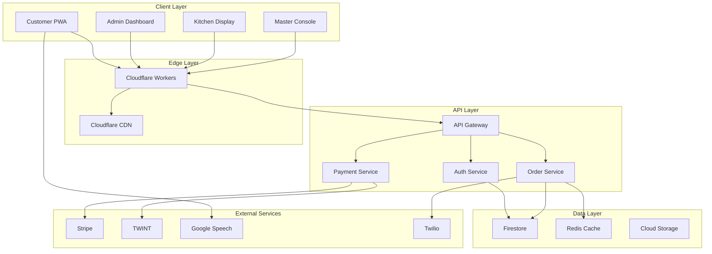

# 🏗️ EATECH Architecture

## Overview

EATECH follows a modern, scalable microservices architecture with a focus on performance, security, and maintainability. The system is designed as a multi-tenant SaaS platform optimized for the Swiss restaurant industry.

## Architecture Principles

1. **Separation of Concerns**: Clear boundaries between presentation, business logic, and data layers
2. **Multi-tenancy**: Secure isolation of tenant data with shared infrastructure
3. **Event-driven**: Asynchronous communication between services
4. **API-first**: RESTful APIs with GraphQL for complex queries
5. **Cloud-native**: Designed for containerization and orchestration
6. **Edge Computing**: Leverage CDN and edge workers for performance

## System Architecture



## Component Architecture

### Frontend Applications

#### Customer PWA (`/apps/web`)
- **Framework**: React 19 with TypeScript
- **State Management**: Zustand for local state, React Query for server state
- **Styling**: Tailwind CSS with CSS Modules for component styles
- **Voice Interface**: Web Speech API with Swiss German recognition
- **Offline Support**: Service Workers with IndexedDB

#### Admin Dashboard (`/apps/admin`)
- **Framework**: React 19 with TypeScript
- **UI Components**: Custom component library (`@eatech/ui`)
- **Real-time Updates**: Firestore real-time listeners
- **Charts**: Recharts for analytics visualization
- **Forms**: React Hook Form with Zod validation

#### Kitchen Display (`/apps/kitchen`)
- **Optimized for**: Touch screens and tablets
- **Real-time**: WebSocket connection for instant updates
- **Performance**: Minimal bundle size, optimized re-renders
- **Reliability**: Automatic reconnection, offline queue

### Backend Services

#### Firebase Cloud Functions (`/services/functions`)
```typescript
// Function Categories
- HTTP Functions (REST API endpoints)
- Scheduled Functions (Cron jobs)
- Firestore Triggers (Database events)
- Auth Triggers (User lifecycle)
```

#### Cloudflare Workers (`/services/workers`)
- **Image Optimization**: On-the-fly image resizing
- **Cache Management**: Intelligent caching strategies
- **Security**: Rate limiting and DDoS protection
- **A/B Testing**: Edge-based feature flags

### Data Architecture

#### Multi-tenant Data Model
```typescript
// Tenant isolation pattern
/tenants/{tenantId}/
  /users/{userId}
  /products/{productId}
  /orders/{orderId}
  /locations/{locationId}
  
// Shared data
/system/
  /features/{featureId}
  /templates/{templateId}
```

#### Database Schema

**Users Collection**
```typescript
interface User {
  id: string;
  tenantId: string;
  email: string;
  role: 'customer' | 'staff' | 'admin' | 'owner';
  profile: {
    name: string;
    phone?: string;
    language: 'de' | 'fr' | 'it' | 'en';
    preferences: UserPreferences;
  };
  createdAt: Timestamp;
  updatedAt: Timestamp;
}
```

**Products Collection**
```typescript
interface Product {
  id: string;
  tenantId: string;
  name: LocalizedString;
  description: LocalizedString;
  price: {
    amount: number;
    currency: 'CHF';
    tax: TaxInfo;
  };
  category: string;
  modifiers: Modifier[];
  availability: Availability;
  images: Image[];
  allergens: Allergen[];
  nutritionalInfo?: NutritionalInfo;
}
```

**Orders Collection**
```typescript
interface Order {
  id: string;
  tenantId: string;
  customerId: string;
  locationId: string;
  items: OrderItem[];
  status: OrderStatus;
  payment: PaymentInfo;
  delivery: DeliveryInfo;
  timing: {
    orderedAt: Timestamp;
    preparationTime: number;
    readyAt?: Timestamp;
    completedAt?: Timestamp;
  };
  voiceOrder?: VoiceOrderMetadata;
}
```

### Security Architecture

#### Authentication & Authorization
- **Firebase Auth**: Social login, email/password, phone auth
- **Custom Claims**: Role-based access control (RBAC)
- **JWT Tokens**: Stateless authentication
- **MFA Support**: SMS and authenticator apps

#### API Security
```typescript
// Middleware stack
1. CORS validation
2. Rate limiting
3. API key validation
4. JWT verification
5. Tenant context injection
6. Permission checking
```

#### Data Security
- **Encryption at Rest**: Firestore built-in encryption
- **Encryption in Transit**: TLS 1.3
- **Field-level Encryption**: Sensitive data (payment info)
- **Data Residency**: Swiss data centers

### Performance Architecture

#### Caching Strategy
```typescript
// Cache layers
1. Browser Cache (Service Worker)
2. CDN Cache (Cloudflare)
3. Application Cache (Redis)
4. Database Cache (Firestore)
```

#### Optimization Techniques
- **Code Splitting**: Route-based and component-based
- **Lazy Loading**: Images and heavy components
- **Bundle Optimization**: Tree shaking, minification
- **API Optimization**: GraphQL for complex queries
- **Database Optimization**: Composite indexes, denormalization

### Scalability Architecture

#### Horizontal Scaling
- **Stateless Services**: All services are stateless
- **Load Balancing**: Cloudflare load balancer
- **Auto-scaling**: Cloud Run automatic scaling
- **Database Sharding**: Tenant-based sharding

#### Vertical Scaling
- **Resource Optimization**: Efficient algorithms
- **Caching**: Multi-level caching strategy
- **Query Optimization**: Firestore composite indexes
- **Connection Pooling**: Reuse database connections

### Monitoring & Observability

#### Logging
```typescript
// Structured logging
{
  timestamp: "2024-01-20T10:30:00Z",
  level: "INFO",
  tenantId: "tenant_123",
  userId: "user_456",
  action: "ORDER_PLACED",
  metadata: { orderId: "order_789" }
}
```

#### Metrics
- **Application Metrics**: Response time, error rate
- **Business Metrics**: Orders/minute, revenue/day
- **Infrastructure Metrics**: CPU, memory, network
- **Custom Metrics**: Voice order success rate

#### Tracing
- **Distributed Tracing**: Trace requests across services
- **Performance Profiling**: Identify bottlenecks
- **Error Tracking**: Sentry integration

### Deployment Architecture

#### CI/CD Pipeline
```yaml
1. Code Commit
2. Automated Tests
3. Build & Bundle
4. Security Scan
5. Deploy to Staging
6. E2E Tests
7. Deploy to Production
8. Smoke Tests
```

#### Infrastructure as Code
- **Terraform**: Cloud resources
- **Kubernetes**: Container orchestration
- **Docker**: Application packaging
- **GitHub Actions**: CI/CD automation

### Disaster Recovery

#### Backup Strategy
- **Automated Backups**: Daily Firestore exports
- **Point-in-time Recovery**: 30-day retention
- **Cross-region Replication**: Swiss + EU backup
- **Backup Testing**: Monthly restore tests

#### High Availability
- **Multi-zone Deployment**: 3 availability zones
- **Failover**: Automatic failover
- **Health Checks**: Continuous monitoring
- **SLA**: 99.9% uptime guarantee

## Technology Decisions

### Why Firebase?
- **Real-time Updates**: Essential for order tracking
- **Scalability**: Automatic scaling
- **Security**: Built-in security rules
- **Swiss Region**: Frankfurt region for compliance

### Why Cloudflare Workers?
- **Edge Computing**: Low latency globally
- **Cost-effective**: Pay per request
- **Security**: DDoS protection included
- **Performance**: Caching and optimization

### Why Monorepo?
- **Code Sharing**: Shared packages
- **Consistency**: Unified tooling
- **Atomic Changes**: Cross-project commits
- **Simplified CI/CD**: Single pipeline

### Why TypeScript?
- **Type Safety**: Catch errors early
- **IDE Support**: Better developer experience
- **Refactoring**: Confident code changes
- **Documentation**: Self-documenting code

## Future Architecture Considerations

### Planned Enhancements
1. **GraphQL Federation**: Microservices with unified schema
2. **Event Sourcing**: Complete audit trail
3. **CQRS**: Separate read/write models
4. **Machine Learning**: Recommendation engine
5. **Blockchain**: Supply chain transparency

### Scalability Roadmap
1. **Multi-region**: Global deployment
2. **Edge Functions**: More edge computing
3. **Serverless**: Complete serverless migration
4. **Kubernetes**: Advanced orchestration
5. **Service Mesh**: Istio integration

---

For implementation details, see the [Development Guide](./DEVELOPMENT.md).
