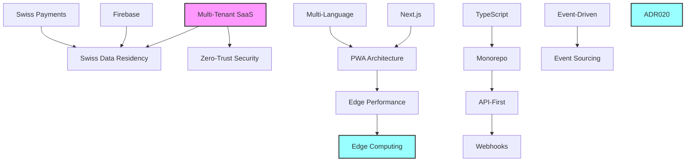

# EATECH V3.0 Architecture Decision Records (ADRs)

**Comprehensive Collection of Architecture Decisions**

**Version:** 3.0.0  
**Decision Authority:** Architecture Review Board  
**Last Updated:** Januar 2025

---

## 📋 Inhaltsverzeichnis

1. [ADR Template](#adr-template)
2. [Foundation Decisions](#foundation-decisions)
3. [Technology Stack Decisions](#technology-stack-decisions)
4. [Architecture Pattern Decisions](#architecture-pattern-decisions)
5. [Security & Compliance Decisions](#security--compliance-decisions)
6. [Performance & Scalability Decisions](#performance--scalability-decisions)
7. [Data Management Decisions](#data-management-decisions)
8. [Integration Decisions](#integration-decisions)
9. [Swiss-Specific Decisions](#swiss-specific-decisions)
10. [Future Architecture Decisions](#future-architecture-decisions)

---

## 📝 ADR Template

### Standard ADR Format

```markdown
# ADR-XXX: [Decision Title]

## Status
[Proposed | Accepted | Deprecated | Superseded]

## Context
[Business and technical context for the decision]

## Decision
[The specific decision being made]

## Consequences
### Positive
- [Benefit 1]
- [Benefit 2]

### Negative
- [Trade-off 1]
- [Trade-off 2]

### Neutral
- [Neutral consequence 1]

## Alternatives Considered
1. [Alternative 1]: [Why not chosen]
2. [Alternative 2]: [Why not chosen]

## Implementation Notes
[Technical implementation details]

## Review Date
[When this decision should be reviewed]

## Decision Makers
- [Name 1] - [Role]
- [Name 2] - [Role]

Date: [YYYY-MM-DD]
```

---

## 🏗️ Foundation Decisions

### ADR-001: Multi-Tenant SaaS Architecture

**Status:** Accepted  
**Date:** 2024-06-01  
**Decision Makers:** Benedikt Thomma (Founder), Architecture Team

#### Context
EATECH needs to serve multiple foodtruck businesses with isolated data, customizable features, and scalable infrastructure while maintaining cost efficiency.

#### Decision
Implement a multi-tenant SaaS architecture with tenant isolation at both database and application levels.

#### Implementation
```javascript
// Tenant isolation strategy
const TenantIsolation = {
  database: {
    strategy: 'Shared database, separate collections',
    pattern: 'tenants/{tenantId}/{collection}/{documentId}',
    isolation: 'Firestore security rules + application-level checks'
  },
  
  application: {
    strategy: 'Shared application instance',
    isolation: 'Tenant context in all requests',
    customization: 'Feature flags + tenant-specific configs'
  },
  
  resources: {
    strategy: 'Shared with fair-use policies',
    limits: 'Rate limiting per tenant',
    monitoring: 'Per-tenant metrics and alerting'
  }
};
```

#### Consequences
**Positive:**
- Cost-efficient scaling (shared infrastructure)
- Rapid customer onboarding
- Centralized updates and maintenance
- Economies of scale

**Negative:**
- Complex tenant isolation requirements
- Performance impact of one tenant on others (noisy neighbor)
- Limited customization compared to dedicated instances

**Neutral:**
- Additional complexity in application design
- Need for robust monitoring and alerting

#### Alternatives Considered
1. **Single-tenant per instance:** Higher costs, operational complexity
2. **Database-per-tenant:** Increased operational overhead, backup complexity
3. **Hybrid approach:** Over-engineering for current scale

---

### ADR-002: Progressive Web App (PWA) Over Native Apps

**Status:** Accepted  
**Date:** 2024-06-15  
**Decision Makers:** Benedikt Thomma, UX Team, Development Team

#### Context
Need to deliver mobile experiences to foodtruck customers and staff without the overhead of maintaining separate iOS and Android applications.

#### Decision
Build a Progressive Web App (PWA) using Next.js with full offline capabilities instead of native mobile applications.

#### Implementation
```javascript
// PWA Implementation Strategy
const PWAStrategy = {
  framework: 'Next.js 14 with App Router',
  serviceWorker: 'Workbox 7 for caching and offline functionality',
  manifest: 'Web App Manifest for installation',
  
  capabilities: {
    offline: 'Full offline order taking and sync',
    push: 'Web Push API for notifications',
    camera: 'Web APIs for photo capture',
    location: 'Geolocation API for location services',
    payment: 'Payment Request API integration'
  },
  
  installation: {
    prompt: 'Custom install prompt for better UX',
    beforeInstallPrompt: 'Defer and show contextual prompt',
    fallback: 'Add to Home Screen instructions'
  }
};
```

#### Consequences
**Positive:**
- Single codebase for all platforms
- No app store dependencies or review processes
- Instant updates without user action
- Lower development and maintenance costs
- Web-standard APIs and broader developer pool

**Negative:**
- Limited access to some native device features
- Performance gap compared to native apps
- Browser inconsistencies and compatibility issues
- PWA awareness and adoption challenges

**Neutral:**
- Different user experience paradigms
- Need for progressive enhancement strategies

#### Alternatives Considered
1. **Native iOS/Android apps:** Higher development costs, longer time to market
2. **React Native:** Cross-platform but still requires app store presence
3. **Hybrid (Cordova/PhoneGap):** Deprecated technology, poor performance

---

### ADR-003: Monorepo Structure with Lerna/Turbo

**Status:** Accepted  
**Date:** 2024-07-01  
**Decision Makers:** Development Team, DevOps Team

#### Context
EATECH consists of multiple applications (customer PWA, admin dashboard, master console) with shared components and business logic.

#### Decision
Use a monorepo structure managed by Turbo and organized by application domains and shared packages.

#### Implementation
```json
{
  "workspaces": [
    "apps/*",
    "packages/*",
    "functions"
  ],
  "devDependencies": {
    "turbo": "^1.10.0",
    "@turbo/gen": "^1.10.0"
  },
  "turbo": {
    "pipeline": {
      "build": {
        "dependsOn": ["^build"],
        "outputs": [".next/**", "dist/**"]
      },
      "test": {
        "dependsOn": ["build"]
      },
      "lint": {},
      "dev": {
        "cache": false
      }
    }
  }
}
```

#### Consequences
**Positive:**
- Shared code and dependencies
- Atomic commits across related changes
- Simplified CI/CD pipeline
- Better code reuse and consistency
- Easier refactoring across applications

**Negative:**
- Larger repository size
- Potential for increased build times
- Tool complexity and setup overhead
- Risk of tight coupling between applications

**Neutral:**
- Different workflow compared to separate repositories
- Need for clear package boundaries

#### Alternatives Considered
1. **Separate repositories:** Increased maintenance overhead, difficult cross-app changes
2. **Git submodules:** Complex dependency management
3. **Package-based approach:** Publishing overhead, versioning complexity

---

## ⚙️ Technology Stack Decisions

### ADR-004: Next.js 14 with App Router

**Status:** Accepted  
**Date:** 2024-07-15  
**Decision Makers:** Frontend Team, Architecture Team

#### Context
Need a modern React framework that supports server-side rendering, static generation, and optimal performance for the PWA.

#### Decision
Use Next.js 14 with the new App Router for all React applications.

#### Implementation
```javascript
// Next.js App Router Structure
const AppRouterStructure = {
  layoutHierarchy: {
    'app/layout.tsx': 'Root layout with providers',
    'app/(auth)/layout.tsx': 'Authentication layout',
    'app/(customer)/layout.tsx': 'Customer app layout',
    'app/admin/layout.tsx': 'Admin dashboard layout'
  },
  
  features: {
    serverComponents: 'Default for better performance',
    streaming: 'Incremental loading with Suspense',
    parallelRoutes: 'Complex layouts with multiple views',
    interceptingRoutes: 'Modal overlays and drawers'
  },
  
  optimization: {
    bundleAnalyzer: '@next/bundle-analyzer',
    imageOptimization: 'Built-in Image component',
    fontOptimization: 'Google Fonts optimization',
    staticGeneration: 'ISG for product catalogs'
  }
};
```

#### Consequences
**Positive:**
- Built-in performance optimizations
- Server Components reduce client-side JavaScript
- Excellent developer experience
- Strong TypeScript support
- Built-in PWA capabilities with next-pwa

**Negative:**
- Learning curve for App Router
- Some third-party libraries not yet compatible
- Potential over-engineering for simple pages

**Neutral:**
- Framework lock-in
- Regular updates require migration effort

#### Alternatives Considered
1. **Create React App:** Limited optimization, build tool complexity
2. **Vite + React:** Manual configuration, less optimization out-of-box
3. **Remix:** Smaller ecosystem, newer framework
4. **SvelteKit:** Different paradigm, smaller community

---

### ADR-005: Firebase as Backend-as-a-Service

**Status:** Accepted  
**Date:** 2024-07-20  
**Decision Makers:** Backend Team, DevOps Team, Architecture Team

#### Context
Need a scalable backend solution that supports real-time features, authentication, and database management with minimal operational overhead.

#### Decision
Use Firebase (Google Cloud Platform) as the primary backend platform with Firestore, Authentication, Cloud Functions, and Cloud Storage.

#### Implementation
```javascript
// Firebase Architecture Setup
const FirebaseArchitecture = {
  services: {
    firestore: {
      region: 'eur3', // Zurich for Swiss data residency
      mode: 'native',
      security: 'Custom security rules',
      indexes: 'Composite indexes for complex queries'
    },
    
    authentication: {
      providers: ['Email/Password', 'Phone', 'Google'],
      mfa: 'SMS + TOTP',
      customClaims: 'Tenant and role information'
    },
    
    functions: {
      runtime: 'Node.js 18',
      region: 'europe-west1',
      triggers: ['HTTP', 'Firestore', 'Auth', 'Scheduled']
    },
    
    storage: {
      buckets: ['uploads', 'processed', 'backups'],
      cdn: 'Firebase CDN + Cloudflare'
    }
  },
  
  configuration: {
    projectStructure: {
      production: 'eatech-prod',
      staging: 'eatech-staging',
      development: 'eatech-dev'
    },
    
    security: {
      rules: 'Multi-tenant security rules',
      iamRoles: 'Principle of least privilege',
      auditLogging: 'Cloud Audit Logs'
    }
  }
};
```

#### Consequences
**Positive:**
- Minimal operational overhead
- Built-in scalability and performance
- Real-time capabilities out of the box
- Strong security model
- Excellent development tools and SDKs
- Swiss/EU data residency options

**Negative:**
- Vendor lock-in to Google Cloud
- Limited control over infrastructure
- Potentially higher costs at scale
- Complex pricing model

**Neutral:**
- NoSQL database paradigm
- Google-specific tools and workflows

#### Alternatives Considered
1. **AWS (DynamoDB + Lambda):** More complex setup, similar lock-in
2. **Custom Node.js + PostgreSQL:** Higher operational overhead
3. **Supabase:** Less mature, smaller ecosystem
4. **Azure CosmosDB:** Less suitable for multi-tenant architecture

---

### ADR-006: TypeScript for Type Safety

**Status:** Accepted  
**Date:** 2024-08-01  
**Decision Makers:** Development Team

#### Context
Need to ensure code quality, reduce runtime errors, and improve developer productivity in a complex multi-tenant system.

#### Decision
Use TypeScript with strict mode for all JavaScript/TypeScript code across the entire codebase.

#### Implementation
```json
{
  "compilerOptions": {
    "strict": true,
    "noUncheckedIndexedAccess": true,
    "exactOptionalPropertyTypes": true,
    "noImplicitReturns": true,
    "noFallthroughCasesInSwitch": true,
    "noImplicitOverride": true,
    "allowUnusedLabels": false,
    "allowUnreachableCode": false,
    "skipLibCheck": false,
    "forceConsistentCasingInFileNames": true
  },
  "include": [
    "apps/**/*",
    "packages/**/*",
    "functions/**/*"
  ]
}
```

#### Consequences
**Positive:**
- Catch errors at compile time
- Better IDE support and refactoring
- Improved code documentation
- Easier onboarding for new developers
- Better API contracts between services

**Negative:**
- Initial setup overhead
- Learning curve for team members
- Slower development initially
- Some third-party libraries lack types

**Neutral:**
- Build step requirement
- Additional tooling complexity

#### Alternatives Considered
1. **JavaScript with JSDoc:** Less enforcement, inconsistent adoption
2. **Flow:** Smaller community, less tooling support
3. **Gradual TypeScript adoption:** Inconsistent codebase, delayed benefits

---

## 🏛️ Architecture Pattern Decisions

### ADR-007: Event-Driven Architecture with CQRS

**Status:** Accepted  
**Date:** 2024-08-15  
**Decision Makers:** Architecture Team, Backend Team

#### Context
Need to handle complex business processes like order management, real-time updates, and multi-service coordination while maintaining data consistency.

#### Decision
Implement Event-Driven Architecture with Command Query Responsibility Segregation (CQRS) for core business domains.

#### Implementation
```javascript
// Event-Driven Architecture Implementation
const EventDrivenArchitecture = {
  // Command Side (Write Model)
  commands: {
    orderService: {
      commands: ['CreateOrder', 'UpdateOrderStatus', 'CancelOrder'],
      events: ['OrderCreated', 'OrderStatusChanged', 'OrderCancelled'],
      aggregates: ['Order', 'OrderItem'],
      repository: 'EventStore (Firestore)'
    }
  },
  
  // Query Side (Read Model)
  queries: {
    orderProjections: {
      views: ['OrderList', 'OrderDetails', 'CustomerOrders'],
      projections: ['DashboardProjection', 'AnalyticsProjection'],
      storage: 'Materialized views in Firestore'
    }
  },
  
  // Event Bus
  eventBus: {
    implementation: 'Firebase Cloud Functions',
    patterns: ['Pub/Sub', 'Event Sourcing', 'Saga'],
    guarantees: 'At-least-once delivery'
  },
  
  // Sagas for Complex Workflows
  sagas: {
    orderProcessing: {
      steps: [
        'ValidateOrder',
        'ProcessPayment', 
        'NotifyKitchen',
        'SendConfirmation'
      ],
      compensation: 'Automatic rollback on failure'
    }
  }
};
```

#### Consequences
**Positive:**
- Loose coupling between services
- Better scalability and resilience
- Audit trail through event logs
- Support for complex business processes
- Real-time capabilities

**Negative:**
- Increased complexity
- Eventual consistency challenges
- Debugging distributed flows
- Potential for event duplication

**Neutral:**
- Different mental model
- Need for comprehensive monitoring

#### Alternatives Considered
1. **Traditional CRUD:** Simpler but less scalable
2. **REST-only architecture:** Tight coupling, synchronous dependencies
3. **Message queues (RabbitMQ/Kafka):** Additional infrastructure complexity

---

### ADR-008: Micro-Frontend Architecture

**Status:** Proposed  
**Date:** 2024-09-01  
**Decision Makers:** Frontend Team, Architecture Team

#### Context
As EATECH grows, different teams need to work independently on different parts of the application while maintaining consistency.

#### Decision
Implement a micro-frontend architecture using Module Federation for better team autonomy and scalability.

#### Implementation
```javascript
// Micro-Frontend Architecture
const MicroFrontendArchitecture = {
  shellApp: {
    responsibility: 'Main shell, routing, shared services',
    technology: 'Next.js with Module Federation',
    owns: ['Authentication', 'Navigation', 'Global State']
  },
  
  microfrontends: {
    orderMicrofrontend: {
      responsibility: 'Order management and processing',
      exposedModules: ['OrderList', 'OrderDetails', 'OrderForm'],
      team: 'Order Team'
    },
    
    productMicrofrontend: {
      responsibility: 'Product catalog and management',
      exposedModules: ['ProductList', 'ProductForm', 'Inventory'],
      team: 'Product Team'
    },
    
    analyticsMicrofrontend: {
      responsibility: 'Analytics and reporting',
      exposedModules: ['Dashboard', 'Reports', 'Charts'],
      team: 'Analytics Team'
    }
  },
  
  sharedDependencies: {
    react: 'Shared singleton',
    uiLibrary: 'Shared design system',
    stateManagement: 'Federated state'
  }
};
```

#### Consequences
**Positive:**
- Team independence and autonomy
- Technology diversity within bounds
- Independent deployments
- Better scaling of development teams

**Negative:**
- Increased complexity
- Runtime overhead
- Coordination challenges
- Potential for inconsistencies

**Neutral:**
- Different development workflow
- Need for strong governance

#### Alternatives Considered
1. **Monolithic frontend:** Team scaling issues
2. **Separate SPAs:** User experience fragmentation
3. **iFrames:** Poor user experience, limited integration

---

## 🔒 Security & Compliance Decisions

### ADR-009: Swiss Data Residency and FADP Compliance

**Status:** Accepted  
**Date:** 2024-09-15  
**Decision Makers:** Legal Team, Compliance Officer, Architecture Team

#### Context
Swiss law requires specific data protection measures and potentially data residency for Swiss customer data.

#### Decision
Implement strict Swiss data residency and full FADP (Federal Act on Data Protection) compliance with EU GDPR alignment.

#### Implementation
```javascript
// Swiss Compliance Implementation
const SwissCompliance = {
  dataResidency: {
    primary: 'europe-west6 (Zurich)',
    backup: 'europe-west3 (Frankfurt)',
    restriction: 'No data outside EU/Switzerland',
    verification: 'Regular compliance audits'
  },
  
  fadpCompliance: {
    legalBasis: 'Consent + Contract + Legitimate Interest',
    dataMinimization: 'Collect only necessary data',
    purposeLimitation: 'Use only for stated purposes',
    storageMinimization: 'Automated data retention policies',
    transparency: 'Clear privacy notices in DE/FR/IT'
  },
  
  dataSubjectRights: {
    access: 'Automated data export API',
    rectification: 'Self-service data correction',
    erasure: 'Automated deletion workflows',
    portability: 'Machine-readable export formats',
    objection: 'Opt-out mechanisms'
  },
  
  technical: {
    encryption: 'AES-256-GCM at rest and in transit',
    pseudonymization: 'Where technically feasible',
    anonymization: 'For analytics and ML training',
    auditLogging: 'All data access logged'
  }
};
```

#### Consequences
**Positive:**
- Legal compliance and risk mitigation
- Customer trust and transparency
- Competitive advantage in Swiss market
- Future-proofing for regulatory changes

**Negative:**
- Higher infrastructure costs
- Reduced vendor options
- Increased development complexity
- Ongoing compliance monitoring overhead

**Neutral:**
- Operational constraints
- Regular legal reviews required

#### Alternatives Considered
1. **EU-only compliance:** Insufficient for Swiss market
2. **Global data storage:** Legal and compliance risks
3. **Hybrid approach:** Complexity without clear benefits

---

### ADR-010: Zero-Trust Security Architecture

**Status:** Accepted  
**Date:** 2024-10-01  
**Decision Makers:** Security Team, Architecture Team

#### Context
Multi-tenant SaaS applications require robust security to prevent data breaches and ensure tenant isolation.

#### Decision
Implement a Zero-Trust security architecture with the principle of "never trust, always verify."

#### Implementation
```javascript
// Zero-Trust Security Implementation
const ZeroTrustSecurity = {
  identity: {
    authentication: 'Multi-factor required for admin roles',
    authorization: 'RBAC + ABAC with context awareness',
    sessions: 'Short-lived tokens with refresh rotation',
    deviceTrust: 'Device fingerprinting and registration'
  },
  
  network: {
    segmentation: 'Tenant-isolated network spaces',
    encryption: 'End-to-end encryption for all communications',
    monitoring: 'Network traffic analysis and anomaly detection',
    firewall: 'Application-level firewalling'
  },
  
  data: {
    classification: 'Automatic data classification',
    encryption: 'Field-level encryption for sensitive data',
    access: 'Attribute-based access control',
    monitoring: 'Data access auditing and alerting'
  },
  
  applications: {
    validation: 'Input validation at all layers',
    scanning: 'Continuous security scanning',
    deployment: 'Secure CI/CD pipeline',
    runtime: 'Runtime application protection'
  }
};
```

#### Consequences
**Positive:**
- Reduced attack surface
- Better incident containment
- Regulatory compliance
- Improved audit capabilities

**Negative:**
- Increased implementation complexity
- Potential performance impact
- Higher operational overhead
- User experience friction

**Neutral:**
- Cultural shift in security mindset
- Ongoing security training requirements

#### Alternatives Considered
1. **Perimeter-based security:** Insufficient for cloud-native applications
2. **Trust-but-verify:** Higher risk profile
3. **Hybrid approach:** Inconsistent security posture

---

## 🚀 Performance & Scalability Decisions

### ADR-011: Edge-First Performance Strategy

**Status:** Accepted  
**Date:** 2024-10-15  
**Decision Makers:** Performance Team, Architecture Team

#### Context
Swiss customers expect fast loading times, and foodtruck operations require immediate responsiveness during peak hours.

#### Decision
Implement an edge-first performance strategy using Cloudflare's global network and edge computing capabilities.

#### Implementation
```javascript
// Edge-First Performance Strategy
const EdgePerformanceStrategy = {
  cdn: {
    provider: 'Cloudflare',
    coverage: '250+ edge locations globally',
    caching: {
      static: 'Aggressive caching with long TTL',
      api: 'Smart caching with edge-side includes',
      personalized: 'Edge-side personalization'
    }
  },
  
  edgeComputing: {
    workers: 'Cloudflare Workers for API endpoints',
    durableObjects: 'Stateful edge computing',
    kv: 'Global key-value storage',
    r2: 'Edge-optimized object storage'
  },
  
  optimization: {
    images: 'Dynamic resizing and format optimization',
    fonts: 'Subset fonts with edge caching',
    javascript: 'Tree shaking and code splitting',
    css: 'Critical CSS inlining'
  },
  
  monitoring: {
    realUserMonitoring: 'Core Web Vitals tracking',
    syntheticMonitoring: 'Global performance testing',
    alerting: 'Performance regression alerts'
  }
};
```

#### Consequences
**Positive:**
- Sub-100ms response times globally
- Improved Core Web Vitals scores
- Better user experience and engagement
- Reduced server load and costs

**Negative:**
- Additional complexity in deployment
- Edge debugging challenges
- Potential vendor lock-in
- Cost for high traffic volumes

**Neutral:**
- New development paradigms
- Edge-specific limitations

#### Alternatives Considered
1. **Traditional CDN only:** Limited dynamic content optimization
2. **Multi-CDN approach:** Increased complexity, limited benefits
3. **Regional deployments:** Higher operational overhead

---

### ADR-012: Horizontal Scaling with Auto-Scaling

**Status:** Accepted  
**Date:** 2024-11-01  
**Decision Makers:** DevOps Team, Architecture Team

#### Context
Foodtruck businesses have unpredictable traffic patterns with significant peaks during meal times and events.

#### Decision
Implement horizontal auto-scaling based on multiple metrics including CPU, memory, request queue depth, and response times.

#### Implementation
```javascript
// Auto-Scaling Configuration
const AutoScalingStrategy = {
  triggers: [
    {
      metric: 'cpu_utilization',
      threshold: 70,
      scaleOutCooldown: '5m',
      scaleInCooldown: '15m'
    },
    {
      metric: 'request_queue_depth',
      threshold: 50,
      scaleOutCooldown: '2m',
      scaleInCooldown: '10m'
    },
    {
      metric: 'response_time_p95',
      threshold: '500ms',
      scaleOutCooldown: '3m',
      scaleInCooldown: '10m'
    }
  ],
  
  scaling: {
    minInstances: 2,
    maxInstances: 100,
    targetCPU: 60,
    scaleUpPolicy: 'StepScaling',
    scaleDownPolicy: 'TargetTracking'
  },
  
  predictiveScaling: {
    enabled: true,
    mealTimePatterns: 'Pre-scale for lunch/dinner rushes',
    eventDetection: 'Scale for local events and festivals',
    weatherImpact: 'Consider weather in scaling decisions'
  }
};
```

#### Consequences
**Positive:**
- Automatic handling of traffic spikes
- Cost optimization during low traffic
- Improved reliability and availability
- Better resource utilization

**Negative:**
- Complexity in configuration and tuning
- Potential for scaling oscillations
- Cold start latencies
- Increased monitoring requirements

**Neutral:**
- Operational paradigm shift
- Need for application statelessness

#### Alternatives Considered
1. **Vertical scaling:** Limited scalability, single point of failure
2. **Manual scaling:** Slow response to traffic changes
3. **Over-provisioning:** Wasteful and expensive

---

## 💾 Data Management Decisions

### ADR-013: Event Sourcing for Order Management

**Status:** Accepted  
**Date:** 2024-11-15  
**Decision Makers:** Backend Team, Business Team

#### Context
Order management requires audit trails, complex state transitions, and the ability to reconstruct order history for business intelligence.

#### Decision
Implement Event Sourcing for the Order domain to capture all state changes as a sequence of events.

#### Implementation
```javascript
// Event Sourcing Implementation
const EventSourcingImplementation = {
  eventStore: {
    storage: 'Firestore collection: events',
    partitioning: 'By tenantId and aggregateId',
    indexing: 'Composite indexes for efficient querying',
    retention: 'Infinite retention for business records'
  },
  
  events: {
    orderCreated: {
      version: 1,
      payload: ['orderId', 'customerId', 'items', 'total'],
      metadata: ['timestamp', 'userId', 'tenantId']
    },
    
    orderStatusChanged: {
      version: 1,
      payload: ['orderId', 'from', 'to', 'reason'],
      metadata: ['timestamp', 'userId', 'estimatedTime']
    },
    
    paymentProcessed: {
      version: 1,
      payload: ['orderId', 'amount', 'method', 'transactionId'],
      metadata: ['timestamp', 'processorResponse']
    }
  },
  
  projections: {
    orderView: 'Current order state for UI',
    orderHistory: 'Complete order timeline',
    analytics: 'Aggregated metrics and KPIs',
    reporting: 'Business intelligence data'
  },
  
  snapshots: {
    frequency: 'Every 100 events',
    storage: 'Separate Firestore collection',
    compression: 'JSON compression for large aggregates'
  }
};
```

#### Consequences
**Positive:**
- Complete audit trail
- Time-travel debugging capabilities
- Business intelligence insights
- Eventual consistency handling
- Compliance and legal requirements

**Negative:**
- Increased storage requirements
- Query complexity for current state
- Event versioning challenges
- Learning curve for developers

**Neutral:**
- Different data modeling approach
- Need for event migration strategies

#### Alternatives Considered
1. **Traditional CRUD:** Lost audit trail, limited business insights
2. **Change Data Capture:** Complex setup, technology dependencies
3. **Hybrid approach:** Inconsistent data patterns

---

### ADR-014: Caching Strategy with Redis

**Status:** Accepted  
**Date:** 2024-12-01  
**Decision Makers:** Backend Team, Performance Team

#### Context
Frequent database queries for menu data, tenant configurations, and session management require optimization for performance and cost.

#### Decision
Implement a multi-layer caching strategy using Redis for application caching and Firestore's built-in caching.

#### Implementation
```javascript
// Multi-Layer Caching Strategy
const CachingStrategy = {
  layers: {
    l1_browser: {
      storage: 'Browser memory + IndexedDB',
      duration: '5-30 minutes',
      data: ['Menu items', 'User preferences', 'App state']
    },
    
    l2_cdn: {
      storage: 'Cloudflare Edge Cache',
      duration: '1-24 hours',
      data: ['Static assets', 'Public API responses']
    },
    
    l3_application: {
      storage: 'Redis (Upstash)',
      duration: '5 minutes - 24 hours',
      data: ['Sessions', 'Tenant configs', 'Hot data']
    },
    
    l4_database: {
      storage: 'Firestore client cache',
      duration: '1 hour',
      data: ['Query results', 'Document snapshots']
    }
  },
  
  patterns: {
    cacheAside: 'Manual cache management',
    writeThrough: 'Critical data consistency',
    writeBack: 'High-write scenarios',
    refreshAhead: 'Predictable access patterns'
  },
  
  invalidation: {
    timeToLive: 'Automatic expiration',
    eventBased: 'Cache invalidation on data changes',
    versioning: 'Version-based cache keys',
    tags: 'Group-based invalidation'
  }
};
```

#### Consequences
**Positive:**
- Significant performance improvements
- Reduced database load and costs
- Better user experience
- Scalability improvements

**Negative:**
- Cache consistency challenges
- Additional infrastructure complexity
- Memory usage overhead
- Debugging complexity

**Neutral:**
- Cache warming strategies needed
- Monitoring and metrics requirements

#### Alternatives Considered
1. **No caching:** Poor performance, high database costs
2. **Database-only caching:** Limited control and flexibility
3. **In-memory caching:** Lost on deployment, not shared

---

## 🔌 Integration Decisions

### ADR-015: API-First Architecture with OpenAPI

**Status:** Accepted  
**Date:** 2024-12-15  
**Decision Makers:** API Team, Frontend Team, Integration Team

#### Context
Multiple client applications, third-party integrations, and future mobile applications require consistent and well-documented APIs.

#### Decision
Implement an API-first architecture with OpenAPI specifications and comprehensive API documentation.

#### Implementation
```yaml
# OpenAPI Specification Example
openapi: 3.0.3
info:
  title: EATECH API
  version: 3.0.0
  description: Multi-tenant foodtruck management API
  
servers:
  - url: https://api.eatech.ch/v3
    description: Production server
  - url: https://staging-api.eatech.ch/v3
    description: Staging server

paths:
  /tenants/{tenantId}/orders:
    get:
      summary: List orders for tenant
      parameters:
        - name: tenantId
          in: path
          required: true
          schema:
            type: string
            format: uuid
      responses:
        '200':
          description: List of orders
          content:
            application/json:
              schema:
                type: array
                items:
                  $ref: '#/components/schemas/Order'
    
    post:
      summary: Create new order
      requestBody:
        required: true
        content:
          application/json:
            schema:
              $ref: '#/components/schemas/CreateOrderRequest'
      responses:
        '201':
          description: Order created
          content:
            application/json:
              schema:
                $ref: '#/components/schemas/Order'

components:
  schemas:
    Order:
      type: object
      properties:
        id:
          type: string
          format: uuid
        orderNumber:
          type: string
          pattern: '^[A-Z]{2,3}-\d{4}-\d{4}$'
        status:
          type: string
          enum: [pending, confirmed, preparing, ready, completed, cancelled]
        total:
          type: number
          format: decimal
          minimum: 0
```

#### Consequences
**Positive:**
- Clear API contracts and documentation
- Client code generation capabilities
- Better testing and validation
- Easier third-party integrations
- API versioning strategy

**Negative:**
- Additional documentation overhead
- Schema maintenance requirements
- Potential over-specification
- Initial setup complexity

**Neutral:**
- API-first development workflow
- Contract-driven development

#### Alternatives Considered
1. **Code-first APIs:** Inconsistent documentation, harder integration
2. **GraphQL only:** Limited REST ecosystem benefits
3. **Minimal documentation:** Poor developer experience

---

### ADR-016: Webhook-Based Integration Pattern

**Status:** Accepted  
**Date:** 2025-01-01  
**Decision Makers:** Integration Team, Partner Team

#### Context
Third-party integrations, payment processors, and partner systems require real-time notifications of business events.

#### Decision
Implement a comprehensive webhook system for external integrations with reliability guarantees.

#### Implementation
```javascript
// Webhook System Implementation
const WebhookSystem = {
  events: [
    'order.created',
    'order.status_changed', 
    'payment.succeeded',
    'payment.failed',
    'product.updated',
    'customer.created'
  ],
  
  reliability: {
    retryPolicy: 'Exponential backoff (1s, 2s, 4s, 8s)',
    maxRetries: 4,
    timeout: 30000, // 30 seconds
    deadLetterQueue: 'Failed webhooks for manual investigation'
  },
  
  security: {
    signatures: 'HMAC-SHA256 signatures',
    encryption: 'TLS 1.3 for all webhook deliveries',
    authentication: 'Webhook-specific secrets',
    ipWhitelisting: 'Optional IP address restrictions'
  },
  
  management: {
    registration: 'Self-service webhook registration',
    testing: 'Webhook testing and simulation tools',
    monitoring: 'Delivery success rate monitoring',
    debugging: 'Request/response logging for debugging'
  }
};
```

#### Consequences
**Positive:**
- Real-time integration capabilities
- Reduced polling and API usage
- Better partner developer experience
- Scalable integration architecture

**Negative:**
- Increased system complexity
- Debugging distributed systems
- Webhook endpoint reliability dependencies
- Security considerations

**Neutral:**
- Partner onboarding requirements
- Monitoring and alerting needs

#### Alternatives Considered
1. **Polling-based integration:** Higher latency, increased API usage
2. **Message queues:** Additional infrastructure, partner complexity
3. **Real-time streaming:** Over-engineering for most use cases

---

## 🇨🇭 Swiss-Specific Decisions

### ADR-017: Swiss Payment Method Integration

**Status:** Accepted  
**Date:** 2025-01-05  
**Decision Makers:** Payment Team, Business Team

#### Context
Swiss customers have specific payment preferences, with Twint being the dominant mobile payment method alongside traditional card payments.

#### Decision
Implement comprehensive Swiss payment method support with Twint as the primary mobile payment option.

#### Implementation
```javascript
// Swiss Payment Integration
const SwissPaymentIntegration = {
  methods: {
    twint: {
      provider: 'Twint API',
      priority: 1,
      coverage: 'Switzerland only',
      features: ['QR codes', 'Deep linking', 'Refunds'],
      limits: { min: 0.05, max: 5000 }
    },
    
    cards: {
      provider: 'Stripe Switzerland',
      priority: 2,
      coverage: 'Global',
      features: ['3D Secure', 'Apple Pay', 'Google Pay'],
      localCards: ['PostFinance Card', 'Maestro']
    },
    
    postfinance: {
      provider: 'PostFinance E-Payment',
      priority: 3,
      coverage: 'Switzerland + Liechtenstein',
      features: ['E-Finance', 'Mobile banking']
    },
    
    cash: {
      provider: 'Manual handling',
      priority: 4,
      coverage: 'Point of sale only',
      features: ['Rounding to 0.05 CHF', 'Change calculation']
    }
  },
  
  localization: {
    currency: 'CHF only',
    rounding: 'Swiss rounding rules (0.05 CHF for cash)',
    taxDisplay: 'Inclusive pricing with tax breakdown',
    receipts: 'Swiss receipt format requirements'
  },
  
  compliance: {
    pciDss: 'Level 1 compliance',
    swissDpa: 'Financial data protection',
    aml: 'Anti-money laundering for large transactions',
    vatReporting: 'Automated VAT calculation and reporting'
  }
};
```

#### Consequences
**Positive:**
- Native Swiss user experience
- Higher conversion rates
- Competitive advantage in Swiss market
- Regulatory compliance

**Negative:**
- Integration complexity
- Multiple payment provider relationships
- Swiss-specific testing requirements
- Limited international applicability

**Neutral:**
- Market-specific features
- Ongoing compliance monitoring

#### Alternatives Considered
1. **International payments only:** Poor user experience for Swiss customers
2. **Single payment provider:** Limited payment method coverage
3. **Swiss banks direct integration:** High complexity, limited benefits

---

### ADR-018: Multi-Language Support for Swiss Market

**Status:** Accepted  
**Date:** 2025-01-10  
**Decision Makers:** UX Team, Business Team

#### Context
Switzerland has four official languages (German, French, Italian, Romansh) and requires inclusive language support for broad market adoption.

#### Decision
Implement comprehensive multi-language support for German, French, Italian, and English, with special consideration for Swiss German dialects.

#### Implementation
```javascript
// Multi-Language Implementation
const MultiLanguageSupport = {
  languages: {
    'de': {
      name: 'Deutsch',
      region: 'CH',
      fallback: 'de-CH',
      coverage: '~63% of Swiss population'
    },
    
    'de-CH': {
      name: 'Schweizerdeutsch',
      region: 'CH',
      dialect: true,
      coverage: 'Swiss German speakers'
    },
    
    'fr': {
      name: 'Français',
      region: 'CH',
      fallback: 'fr-CH',
      coverage: '~23% of Swiss population'
    },
    
    'it': {
      name: 'Italiano',
      region: 'CH',
      fallback: 'it-CH',
      coverage: '~8% of Swiss population'
    },
    
    'en': {
      name: 'English',
      region: 'International',
      fallback: 'en-US',
      coverage: 'Tourists and expats'
    }
  },
  
  implementation: {
    framework: 'next-i18next + react-i18next',
    storage: 'JSON files with namespaces',
    fallback: 'Hierarchical fallback system',
    detection: 'Browser language + user preference'
  },
  
  contentStrategy: {
    professional: 'Professional translation services',
    community: 'Community contributions for Swiss German',
    validation: 'Native speaker review process',
    maintenance: 'Regular content audits and updates'
  },
  
  technical: {
    lazyLoading: 'Load language packs on demand',
    caching: 'CDN caching of translation files',
    api: 'Backend API responses in user language',
    formatting: 'Locale-specific number, date, currency formatting'
  }
};
```

#### Consequences
**Positive:**
- Inclusive user experience for all Swiss users
- Market expansion opportunities
- Regulatory compliance for public businesses
- Tourist and expat accessibility

**Negative:**
- Translation costs and maintenance
- Increased application complexity
- Content management overhead
- Testing across multiple languages

**Neutral:**
- Cultural adaptation requirements
- Ongoing localization processes

#### Alternatives Considered
1. **German only:** Excludes significant market segments
2. **German + French only:** Incomplete Swiss coverage
3. **Automated translation:** Poor quality, cultural misunderstandings

---

## 🔮 Future Architecture Decisions

### ADR-019: Edge Computing Migration Strategy

**Status:** Proposed  
**Date:** 2025-01-15  
**Decision Makers:** Architecture Team, Performance Team

#### Context
As EATECH scales globally and performance requirements increase, edge computing can provide significant latency and user experience improvements.

#### Decision
Migrate compute-intensive operations to edge computing platforms, starting with Cloudflare Workers and expanding to other edge providers.

#### Implementation
```javascript
// Edge Computing Migration Strategy
const EdgeMigrationStrategy = {
  phases: {
    phase1: {
      scope: 'Static content and CDN optimization',
      timeline: 'Q2 2025',
      technologies: ['Cloudflare Workers', 'Edge-side includes'],
      benefits: 'Improved static content delivery'
    },
    
    phase2: {
      scope: 'API endpoints and business logic',
      timeline: 'Q3 2025', 
      technologies: ['Durable Objects', 'Workers KV'],
      benefits: 'Reduced API latency globally'
    },
    
    phase3: {
      scope: 'Real-time features and state management',
      timeline: 'Q4 2025',
      technologies: ['WebSockets at edge', 'Distributed state'],
      benefits: 'Global real-time capabilities'
    }
  },
  
  architecture: {
    distribution: 'Multi-provider edge deployment',
    dataConsistency: 'Eventual consistency with conflict resolution',
    fallback: 'Graceful degradation to centralized services',
    monitoring: 'Edge-specific monitoring and alerting'
  },
  
  challenges: {
    statefulOperations: 'Complex state management at edge',
    debugging: 'Distributed debugging challenges',
    costOptimization: 'Edge computing cost vs. performance trade-offs',
    vendor lock-in: 'Multi-provider strategy for vendor independence'
  }
};
```

#### Consequences
**Positive:**
- Global sub-50ms response times
- Improved user experience worldwide
- Reduced infrastructure costs
- Better scalability and resilience

**Negative:**
- Increased architectural complexity
- Edge computing limitations and constraints
- Debugging and monitoring challenges
- Migration effort and risks

**Neutral:**
- New development paradigms
- Team training requirements

#### Alternatives Considered
1. **Multi-region deployment:** Higher operational complexity, limited benefits
2. **CDN-only optimization:** Limited dynamic content improvements
3. **Hybrid approach:** Complexity without full edge benefits

---

### ADR-020: AI-Native Architecture Evolution

**Status:** Proposed  
**Date:** 2025-01-20  
**Decision Makers:** AI Team, Architecture Team, Business Team

#### Context
AI and machine learning capabilities are becoming central to EATECH's value proposition, requiring architectural changes to support AI-native operations.

#### Decision
Evolve the architecture to be AI-native with built-in ML pipelines, real-time inference, and automated decision-making capabilities.

#### Implementation
```javascript
// AI-Native Architecture Evolution
const AINativeArchitecture = {
  mlPlatform: {
    training: 'Google AI Platform + MLflow',
    inference: 'TensorFlow Serving + Edge inference',
    featureStore: 'Feast for feature management',
    monitoring: 'Evidently AI for model monitoring'
  },
  
  aiServices: {
    demandForecasting: {
      models: ['LSTM for time series', 'XGBoost for features'],
      inputs: ['Historical orders', 'Weather', 'Events', 'Holidays'],
      outputs: ['Hourly demand predictions', 'Confidence intervals'],
      retraining: 'Weekly with new data'
    },
    
    priceOptimization: {
      models: ['Multi-armed bandit', 'Price elasticity models'],
      inputs: ['Demand', 'Competition', 'Inventory', 'Customer segments'],
      outputs: ['Optimal pricing', 'Revenue projections'],
      realtime: 'Dynamic pricing updates'
    },
    
    voiceCommerce: {
      models: ['Whisper for speech-to-text', 'GPT for intent parsing'],
      inputs: ['Audio streams', 'Context data', 'Menu information'],
      outputs: ['Order structures', 'Clarification questions'],
      languages: ['German', 'French', 'Italian', 'Swiss German']
    }
  },
  
  dataInfrastructure: {
    pipeline: 'Real-time streaming with Apache Kafka',
    storage: 'Data lake with versioned datasets',
    processing: 'Batch + stream processing with Apache Beam',
    governance: 'Data lineage and quality monitoring'
  }
};
```

#### Consequences
**Positive:**
- Competitive advantage through AI capabilities
- Automated operations and optimization
- Improved business insights and decisions
- Scalable intelligence across the platform

**Negative:**
- Significant architectural complexity
- Data quality and privacy requirements
- Model training and maintenance overhead
- AI expertise and hiring requirements

**Neutral:**
- AI/ML development lifecycle changes
- Ethical AI considerations and governance

#### Alternatives Considered
1. **Third-party AI services only:** Limited customization and control
2. **Gradual AI integration:** Slower competitive advantage
3. **AI as a separate system:** Integration complexity, limited benefits

---

## 📊 Decision Impact Analysis

### Decision Dependencies



### Risk Assessment Matrix

```javascript
const DecisionRiskAssessment = {
  highRisk: [
    {
      decision: 'ADR-019: Edge Computing Migration',
      risks: ['Complex migration', 'Vendor lock-in', 'Performance debugging'],
      mitigation: 'Phased rollout, multi-provider strategy, comprehensive monitoring'
    },
    {
      decision: 'ADR-020: AI-Native Architecture',
      risks: ['Model accuracy', 'Data privacy', 'Training costs'],
      mitigation: 'Extensive testing, privacy-first design, cost monitoring'
    }
  ],
  
  mediumRisk: [
    {
      decision: 'ADR-007: Event-Driven Architecture',
      risks: ['Eventual consistency', 'Debugging complexity', 'Event duplication'],
      mitigation: 'Comprehensive monitoring, event deduplication, testing'
    },
    {
      decision: 'ADR-013: Event Sourcing',
      risks: ['Storage costs', 'Query complexity', 'Migration challenges'],
      mitigation: 'Compression, CQRS projections, migration tools'
    }
  ],
  
  lowRisk: [
    {
      decision: 'ADR-006: TypeScript',
      risks: ['Learning curve', 'Build complexity'],
      mitigation: 'Team training, gradual adoption'
    },
    {
      decision: 'ADR-018: Multi-Language Support',
      risks: ['Translation costs', 'Content management'],
      mitigation: 'Professional translation, automated workflows'
    }
  ]
};
```

---

## 📅 Review Schedule

### Regular Review Process

```bash
# Quarterly Architecture Reviews
Q1 2025: Performance and scalability decisions review
Q2 2025: Edge computing implementation assessment
Q3 2025: AI architecture evolution planning
Q4 2025: Annual architecture strategy review

# Ad-hoc Reviews
- Technology landscape changes
- Business requirement shifts
- Performance or security issues
- Regulatory requirement updates

# Review Participants
- Architecture Review Board
- Technical Teams
- Business Stakeholders
- Security and Compliance Teams
```

### Decision Lifecycle

```javascript
const DecisionLifecycle = {
  proposal: {
    duration: '1-2 weeks',
    activities: ['Problem definition', 'Options analysis', 'Impact assessment'],
    deliverables: ['ADR draft', 'Proof of concept (if needed)']
  },
  
  review: {
    duration: '1 week',
    activities: ['Peer review', 'Stakeholder feedback', 'Risk assessment'],
    deliverables: ['Review comments', 'Approval/rejection decision']
  },
  
  implementation: {
    duration: 'Variable',
    activities: ['Implementation planning', 'Execution', 'Testing'],
    deliverables: ['Implementation plan', 'Working system', 'Documentation']
  },
  
  monitoring: {
    duration: 'Ongoing',
    activities: ['Performance monitoring', 'Success metrics', 'Issue tracking'],
    deliverables: ['Metrics reports', 'Lessons learned', 'Improvement recommendations']
  }
};
```

---

## 📞 Architecture Decision Support

### Contact Information

```bash
# Architecture Review Board
🏗️ Chief Architect: benedikt@thomma.ch
👥 Architecture Team: architecture@eatech.ch
📋 ADR Repository: https://github.com/eatech/adrs
📚 Architecture Wiki: https://wiki.eatech.ch/architecture

# Decision Process
📝 ADR Template: Available in repository
🔄 Review Process: Documented in wiki
📊 Decision Tracking: Managed in project board
📈 Impact Analysis: Quarterly review reports
```

### Tools and Resources

```bash
# ADR Tools
- ADR-tools CLI for ADR management
- PlantUML for architecture diagrams  
- Mermaid for decision flow charts
- Confluence for collaborative editing

# Templates and Examples
- Decision template library
- Risk assessment frameworks
- Implementation checklists
- Review guidelines
```

---

*Last Updated: Januar 2025 - EATECH V3.0*  
*Diese ADRs dokumentieren die wichtigsten Architekturentscheidungen für EATECH V3.0*  
*Für Fragen oder neue ADRs: [architecture@eatech.ch](mailto:architecture@eatech.ch)*