# EATECH V3.0 Architecture Diagrams

**Comprehensive Visual Architecture Documentation**

**Version:** 3.0.0  
**Diagram Tool:** Mermaid.js + PlantUML  
**Last Updated:** Januar 2025

---

## 📋 Inhaltsverzeichnis

1. [System Overview Diagrams](#system-overview-diagrams)
2. [Application Architecture Diagrams](#application-architecture-diagrams)
3. [Data Architecture Diagrams](#data-architecture-diagrams)
4. [Infrastructure Diagrams](#infrastructure-diagrams)
5. [Security Architecture Diagrams](#security-architecture-diagrams)
6. [Integration Diagrams](#integration-diagrams)
7. [Deployment Diagrams](#deployment-diagrams)
8. [Sequence Diagrams](#sequence-diagrams)
9. [Swiss-Specific Diagrams](#swiss-specific-diagrams)
10. [Future Architecture Diagrams](#future-architecture-diagrams)

---

## 🌐 System Overview Diagrams

### High-Level System Architecture

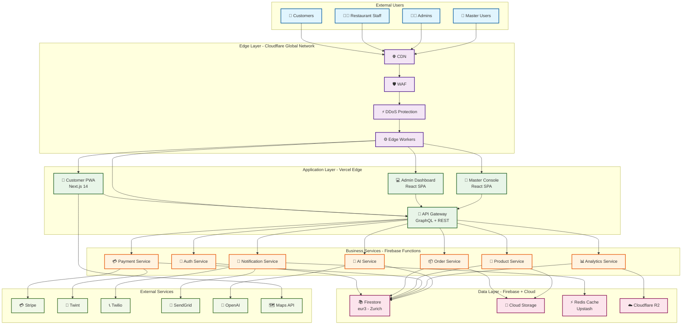

### Multi-Tenant Architecture Overview

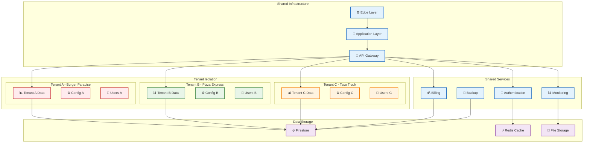

---

## 📱 Application Architecture Diagrams

### Customer PWA Architecture

```mermaid
graph TB
    subgraph "Customer PWA - Next.js 14"
        subgraph "App Router Structure"
            ROOT[app/layout.tsx<br/>🏠 Root Layout]
            AUTH_LAYOUT[app/(auth)/layout.tsx<br/>🔐 Auth Layout]
            CUSTOMER_LAYOUT[app/(customer)/layout.tsx<br/>👤 Customer Layout]
            
            LOGIN[app/(auth)/login/page.tsx<br/>🚪 Login Page]
            REGISTER[app/(auth)/register/page.tsx<br/>📝 Register Page]
            
            MENU[app/(customer)/menu/page.tsx<br/>🍔 Menu Page]
            CART[app/(customer)/cart/page.tsx<br/>🛒 Cart Page]
            CHECKOUT[app/(customer)/checkout/page.tsx<br/>💳 Checkout Page]
            ORDERS[app/(customer)/orders/page.tsx<br/>📦 Orders Page]
        end
        
        subgraph "API Routes"
            API_AUTH[app/api/auth/route.ts<br/>🔑 Auth API]
            API_ORDERS[app/api/orders/route.ts<br/>📦 Orders API]
            API_PRODUCTS[app/api/products/route.ts<br/>🍔 Products API]
            API_VOICE[app/api/voice/route.ts<br/>🎤 Voice API]
        end
        
        subgraph "Components"
            HEADER[components/Header<br/>📱 Navigation]
            PRODUCT_CARD[components/ProductCard<br/>🍔 Product Display]
            CART_ITEM[components/CartItem<br/>🛒 Cart Item]
            ORDER_STATUS[components/OrderStatus<br/>📊 Status Display]
        end
        
        subgraph "Features"
            MENU_FEATURE[features/menu<br/>🍽️ Menu Management]
            CART_FEATURE[features/cart<br/>🛒 Cart Logic]
            CHECKOUT_FEATURE[features/checkout<br/>💳 Checkout Flow]
            VOICE_FEATURE[features/voice<br/>🎤 Voice Commerce]
        end
        
        subgraph "PWA Features"
            SW[🔧 Service Worker]
            MANIFEST[📋 Web Manifest]
            OFFLINE[📴 Offline Support]
            PUSH[📢 Push Notifications]
        end
    end
    
    %% Layout Hierarchy
    ROOT --> AUTH_LAYOUT
    ROOT --> CUSTOMER_LAYOUT
    AUTH_LAYOUT --> LOGIN
    AUTH_LAYOUT --> REGISTER
    CUSTOMER_LAYOUT --> MENU
    CUSTOMER_LAYOUT --> CART
    CUSTOMER_LAYOUT --> CHECKOUT
    CUSTOMER_LAYOUT --> ORDERS
    
    %% Component Usage
    MENU --> PRODUCT_CARD
    CART --> CART_ITEM
    ORDERS --> ORDER_STATUS
    
    %% Feature Integration
    MENU --> MENU_FEATURE
    CART --> CART_FEATURE
    CHECKOUT --> CHECKOUT_FEATURE
    
    %% API Connections
    LOGIN --> API_AUTH
    MENU --> API_PRODUCTS
    CART --> API_ORDERS
    CHECKOUT --> API_ORDERS
    
    %% PWA Integration
    ROOT --> SW
    ROOT --> MANIFEST
    SW --> OFFLINE
    SW --> PUSH
    
    %% Styling
    classDef layout fill:#e3f2fd,stroke:#1565c0,stroke-width:2px
    classDef page fill:#e8f5e8,stroke:#2e7d32,stroke-width:2px
    classDef api fill:#fff3e0,stroke:#f57c00,stroke-width:2px
    classDef component fill:#f3e5f5,stroke:#7b1fa2,stroke-width:2px
    classDef feature fill:#ffebee,stroke:#c62828,stroke-width:2px
    classDef pwa fill:#e0f2f1,stroke:#00695c,stroke-width:2px
    
    class ROOT,AUTH_LAYOUT,CUSTOMER_LAYOUT layout
    class LOGIN,REGISTER,MENU,CART,CHECKOUT,ORDERS page
    class API_AUTH,API_ORDERS,API_PRODUCTS,API_VOICE api
    class HEADER,PRODUCT_CARD,CART_ITEM,ORDER_STATUS component
    class MENU_FEATURE,CART_FEATURE,CHECKOUT_FEATURE,VOICE_FEATURE feature
    class SW,MANIFEST,OFFLINE,PUSH pwa
```

### Admin Dashboard Architecture

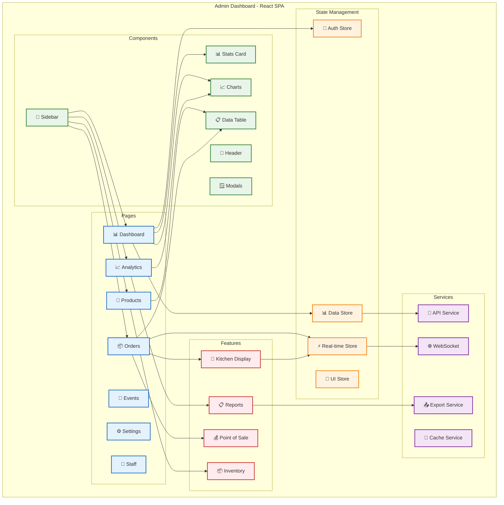

---

## 💾 Data Architecture Diagrams

### Firestore Data Model

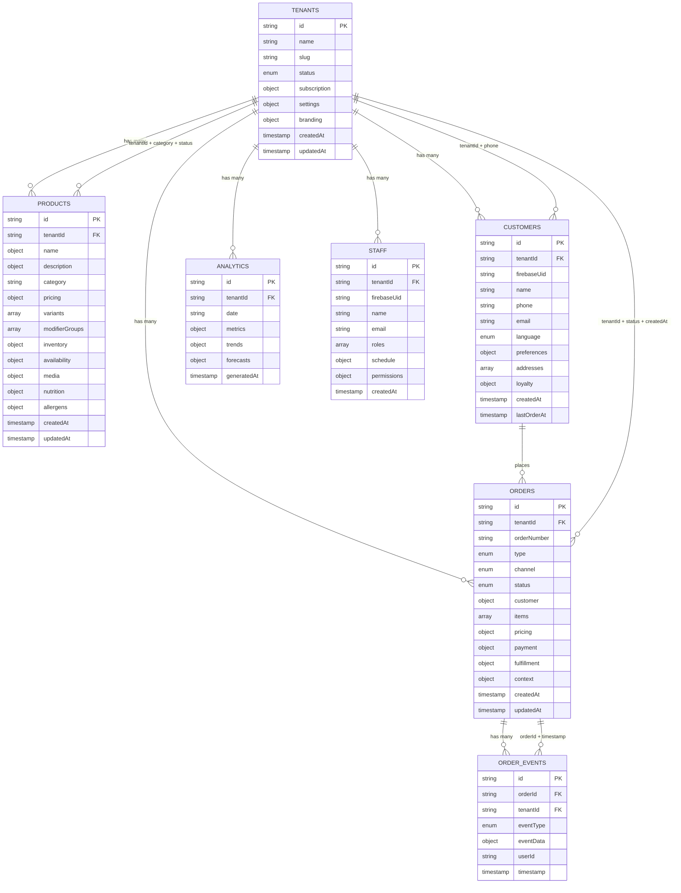

### Caching Architecture

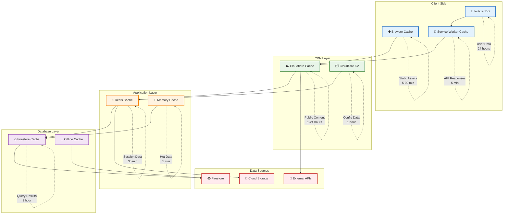

---

## 🏗️ Infrastructure Diagrams

### Cloud Infrastructure Overview

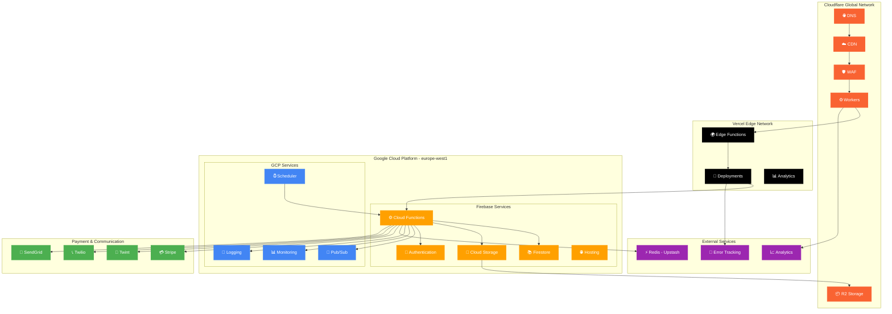

### Network Security Architecture

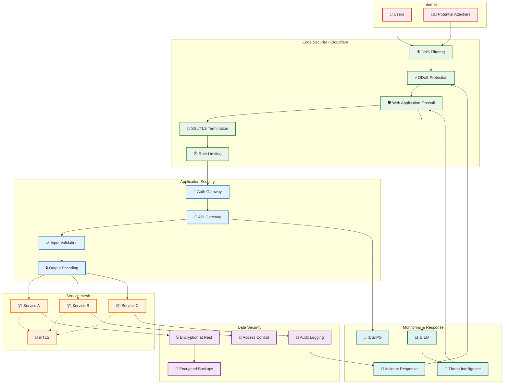

---

## 🔄 Sequence Diagrams

### Order Creation Flow

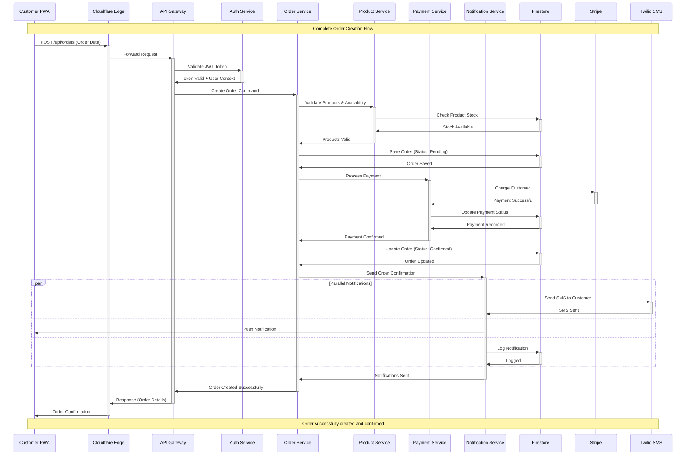

### Real-time Kitchen Updates

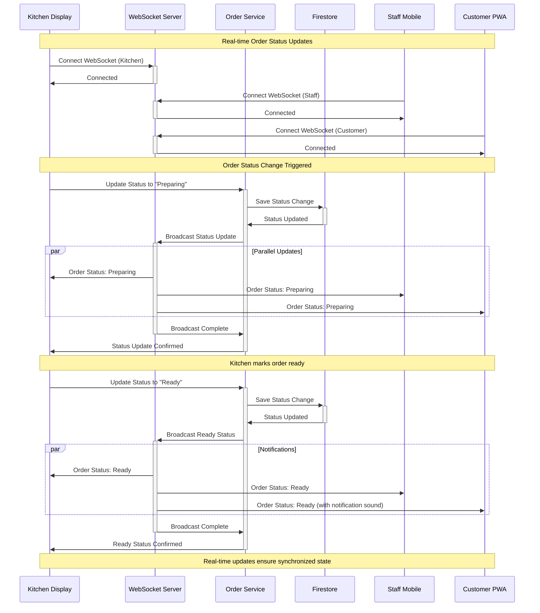

---

## 🇨🇭 Swiss-Specific Diagrams

### Swiss Payment Integration Flow

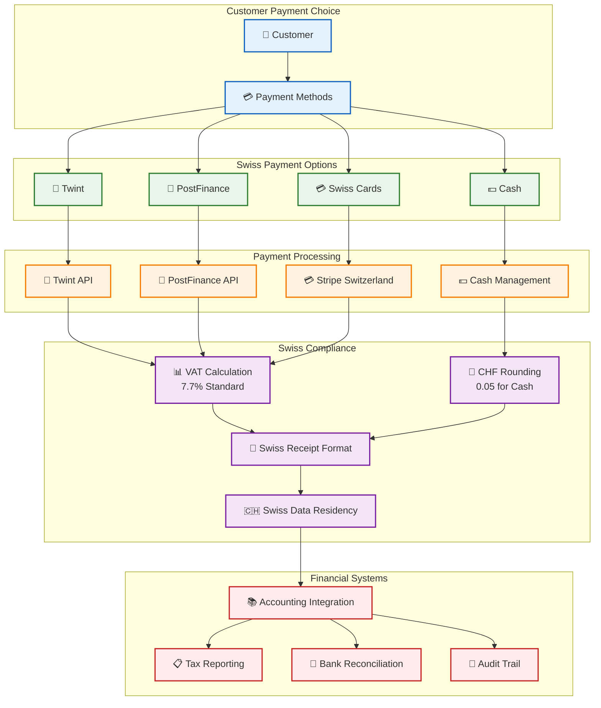

### Swiss Data Protection Architecture

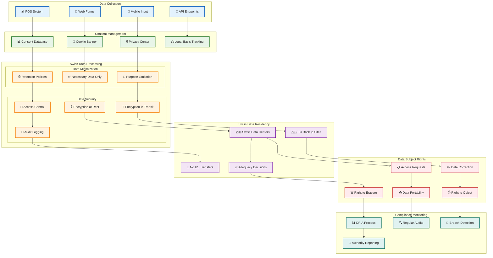

---

## 🔮 Future Architecture Diagrams

### Edge Computing Evolution

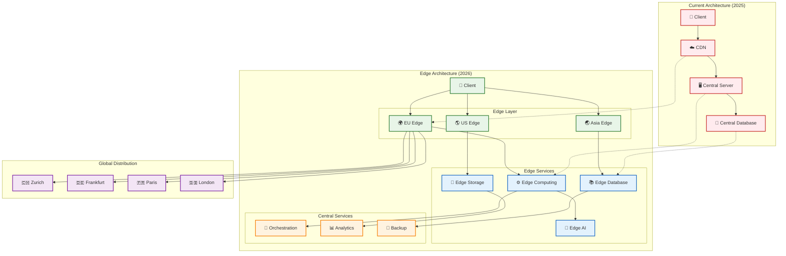

### AI-Native Architecture Vision

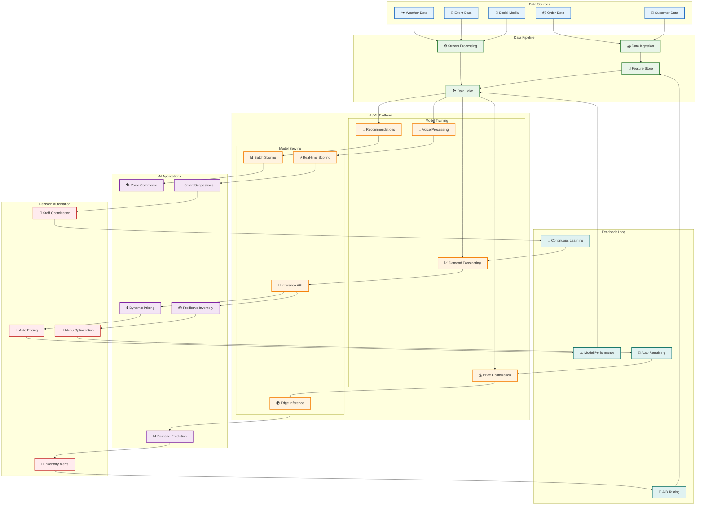

---

## 📊 Diagram Legend

### Symbols and Colors

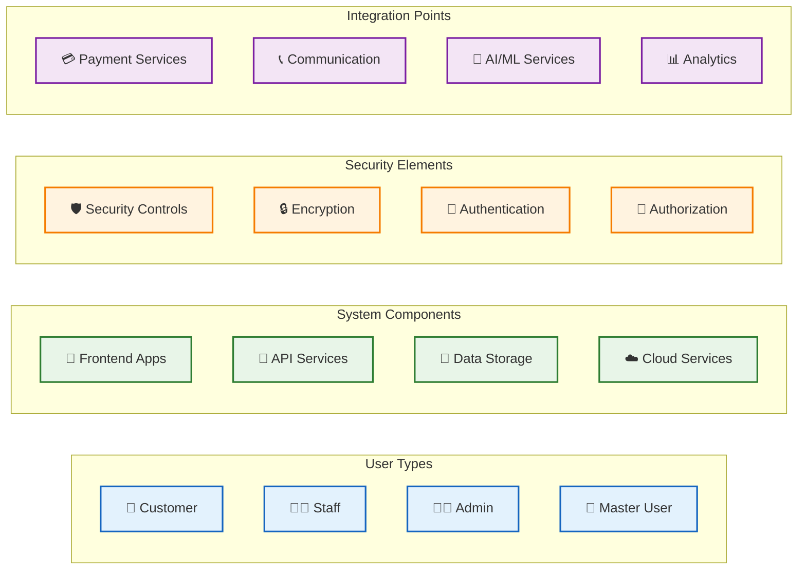

### Relationship Types

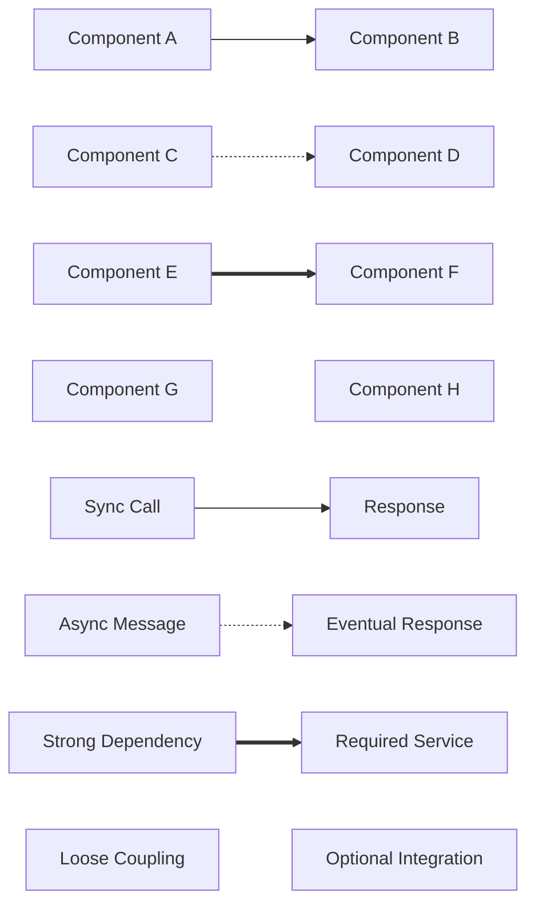

---

## 📞 Diagram Maintenance

### Tools and Standards

```bash
# Diagram Tools
📊 Mermaid.js: Online flowcharts and diagrams
🏗️ PlantUML: Complex architecture diagrams
🎨 Draw.io: Visual architecture documentation
📝 Markdown: Embedded diagrams in documentation

# Standards
🎯 Consistent color coding across all diagrams
📏 Standard symbols for common components
🔄 Regular updates with architecture changes
📋 Version control for all diagram sources

# Maintenance Schedule
📅 Monthly: Review and update diagrams
🔄 Quarterly: Major architecture diagram review
📊 Annually: Complete diagram architecture audit
🎯 On-demand: Updates for significant changes
```

### Diagram Guidelines

```markdown
# Diagram Creation Guidelines

## Consistency Rules
- Use consistent colors for similar components
- Follow established symbol conventions
- Maintain readable font sizes and spacing
- Include legends for complex diagrams

## Update Process
1. Update diagrams with architecture changes
2. Review diagrams in code reviews
3. Validate diagrams with stakeholders
4. Version control diagram sources

## Quality Checklist
- [ ] Diagram accurately represents current architecture
- [ ] All components are labeled clearly
- [ ] Relationships are correctly depicted
- [ ] Colors and symbols follow standards
- [ ] Diagram is readable at various sizes
```

---

*Last Updated: Januar 2025 - EATECH V3.0*  
*Diese Diagramme visualisieren die EATECH V3.0 Architektur umfassend*  
*Für Diagramm-Updates: [architecture@eatech.ch](mailto:architecture@eatech.ch)*