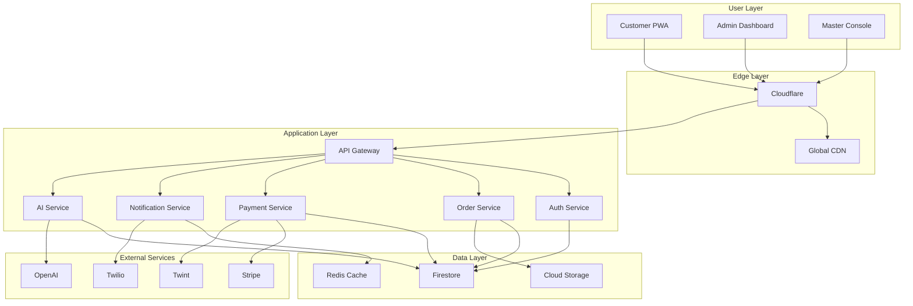
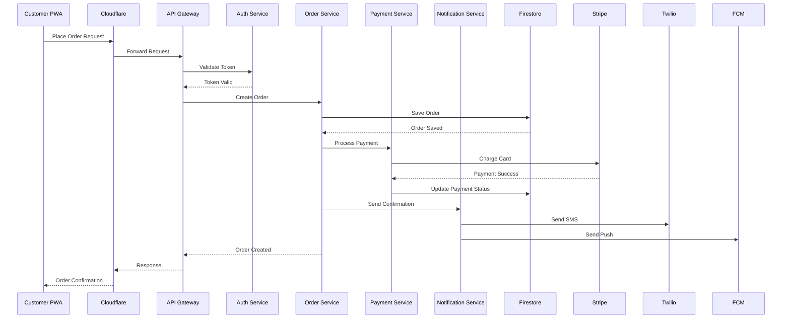

# EATECH V3.0 Architecture Overview

**Comprehensive System Architecture Documentation**

**Version:** 3.0.0  
**Architecture Style:** Multi-Cloud Microservices + Monorepo  
**Target Scale:** 1000+ Tenants, 100,000+ Orders/Day  
**Last Updated:** Januar 2025

---

## 📋 Inhaltsverzeichnis

1. [Architecture Philosophy](#architecture-philosophy)
2. [System Overview](#system-overview)
3. [Technology Stack](#technology-stack)
4. [Application Architecture](#application-architecture)
5. [Data Architecture](#data-architecture)
6. [Infrastructure Architecture](#infrastructure-architecture)
7. [Security Architecture](#security-architecture)
8. [Performance & Scalability](#performance--scalability)
9. [Deployment Architecture](#deployment-architecture)
10. [Future Architecture](#future-architecture)

---

## 🏗️ Architecture Philosophy

### Design Principles

```javascript
const ArchitecturePrinciples = {
  // 1. Swiss-First Design
  swissFirst: {
    dataResidency: 'EU/Switzerland only',
    compliance: ['FADP/DSG', 'GDPR', 'PCI DSS'],
    languages: ['DE', 'FR', 'IT', 'EN', 'DE-CH'],
    currency: 'CHF primary',
    paymentMethods: ['Twint', 'Swiss Cards', 'Cash']
  },
  
  // 2. Multi-Tenant by Design
  multiTenancy: {
    isolation: 'Database level + Application level',
    scalability: 'Tenant-specific resource allocation',
    customization: 'Per-tenant branding & features',
    security: 'Zero-trust between tenants'
  },
  
  // 3. Mobile-First PWA
  mobileFirst: {
    approach: 'Progressive Web App (PWA)',
    offline: 'Full offline functionality',
    performance: 'Sub-3s loading, 60fps interactions',
    installability: 'One-click installation'
  },
  
  // 4. Event-Driven Architecture
  eventDriven: {
    patterns: ['CQRS', 'Event Sourcing', 'Saga Pattern'],
    realtime: 'WebSocket + Server-Sent Events',
    reliability: 'At-least-once delivery + idempotency',
    scalability: 'Horizontal scaling through events'
  },
  
  // 5. Zero-Downtime Operations
  zeroDowntime: {
    deployment: 'Blue-green + canary releases',
    database: 'Zero-downtime migrations',
    monitoring: 'Proactive alerting + auto-healing',
    recovery: 'Sub-5-minute recovery time'
  }
};
```

### Quality Attributes

```
🎯 Primary Quality Attributes:
├── Scalability: Handle 1000+ tenants simultaneously
├── Performance: <200ms API response, <3s page load
├── Availability: 99.9% uptime (43.2 min/month downtime)
├── Security: Enterprise-grade with Swiss compliance
├── Usability: Intuitive for non-tech foodtruck operators
└── Maintainability: Clean code, comprehensive testing

🔧 Secondary Quality Attributes:
├── Portability: Multi-cloud ready
├── Interoperability: Open APIs & webhooks
├── Testability: 90%+ code coverage
├── Monitorability: Full observability stack
├── Recoverability: <5 minute RTO, <1 hour RPO
└── Compliance: FADP, GDPR, PCI DSS Level 1
```

---

## 🌐 System Overview

### High-Level Architecture

```
┌─────────────────────────────────────────────────────────────────┐
│                        EATECH V3.0 System                      │
├─────────────────────────────────────────────────────────────────┤
│  🌐 Edge Layer (Cloudflare Global)                             │
│  ├── CDN: Global content delivery                              │
│  ├── WAF: Web Application Firewall                             │
│  ├── DDoS: Attack protection                                   │
│  └── SSL: TLS 1.3 termination                                  │
├─────────────────────────────────────────────────────────────────┤
│  🖥️ Presentation Layer (Vercel Edge)                           │
│  ├── Customer PWA: Next.js 14 + React 18                      │
│  ├── Admin Dashboard: React SPA                                │
│  ├── Master Console: Management interface                       │
│  └── Public API: GraphQL + REST                                │
├─────────────────────────────────────────────────────────────────┤
│  ⚙️ Application Layer (Firebase + Vercel)                      │
│  ├── Auth Service: Multi-tenant authentication                 │
│  ├── Order Service: Order management + processing              │
│  ├── Product Service: Catalog management                       │
│  ├── Payment Service: Multi-provider payments                  │
│  ├── Notification Service: Push + SMS + Email                  │
│  ├── Analytics Service: Real-time + batch processing           │
│  └── AI Service: ML models + intelligent automation            │
├─────────────────────────────────────────────────────────────────┤
│  💾 Data Layer (Firebase + Cloudflare)                         │
│  ├── Firestore: Operational data (eur3 - Zurich)              │
│  ├── Cloud Storage: Files + media                              │
│  ├── Cloudflare R2: CDN + backup storage                       │
│  └── Redis: Session + cache + real-time                        │
├─────────────────────────────────────────────────────────────────┤
│  🔌 Integration Layer                                           │
│  ├── Payment: Stripe + Twint + PostFinance                     │
│  ├── Communication: Twilio + SendGrid + FCM                    │
│  ├── AI/ML: OpenAI + Google AI                                 │
│  ├── Monitoring: Sentry + DataDog + Plausible                  │
│  └── Third-party: Various Swiss business services              │
└─────────────────────────────────────────────────────────────────┘
```

### Component Interaction Flow



---

## 🛠️ Technology Stack

### Frontend Stack

```javascript
const FrontendStack = {
  // Core Framework
  framework: {
    name: 'Next.js',
    version: '14.0.0',
    features: ['App Router', 'Server Components', 'Streaming SSR'],
    bundler: 'Turbopack',
    runtime: 'Edge Runtime'
  },
  
  // UI Library
  ui: {
    library: 'React',
    version: '18.2.0',
    features: ['Concurrent Features', 'Suspense', 'Server Components'],
    stateManagement: 'Zustand + React Query',
    styling: 'CSS Modules + Tailwind CSS'
  },
  
  // PWA Capabilities
  pwa: {
    serviceWorker: 'Workbox 7',
    manifest: 'Web App Manifest',
    caching: 'Cache-First + Network-First strategies',
    offline: 'Full offline functionality',
    installPrompt: 'Custom install experience'
  },
  
  // Performance
  performance: {
    bundleAnalysis: 'Next.js Bundle Analyzer',
    codesplitting: 'Route-based + component-based',
    imageOptimization: 'Next.js Image + Cloudflare',
    fontOptimization: 'Next.js Font optimization',
    prefetching: 'Intelligent prefetching'
  },
  
  // TypeScript
  typescript: {
    version: '5.3.0',
    strictMode: true,
    configuration: 'Strict + strict null checks',
    codegen: 'GraphQL Code Generator'
  }
};
```

### Backend Stack

```javascript
const BackendStack = {
  // Runtime Environment
  runtime: {
    platform: 'Node.js',
    version: '18.17.0',
    engine: 'V8',
    architecture: 'ARM64 + x64'
  },
  
  // Application Framework
  api: {
    rest: 'Next.js API Routes',
    graphql: 'Apollo Server',
    validation: 'Zod + Joi',
    documentation: 'OpenAPI 3.0 + GraphQL Schema'
  },
  
  // Database & Storage
  database: {
    primary: 'Firebase Firestore',
    location: 'eur3 (Zurich)',
    backup: 'Daily automated backups',
    search: 'Algolia',
    cache: 'Redis (Upstash)'
  },
  
  // Authentication
  auth: {
    provider: 'Firebase Auth',
    strategies: ['Email/Password', 'Phone/SMS', 'Google SSO'],
    sessions: 'JWT + Redis sessions',
    mfa: 'TOTP + SMS'
  },
  
  // Background Processing
  backgroundJobs: {
    scheduler: 'Firebase Cloud Functions',
    queues: 'Cloud Tasks',
    cronJobs: 'Cloud Scheduler',
    eventProcessing: 'Firestore Triggers'
  }
};
```

### Infrastructure Stack

```javascript
const InfrastructureStack = {
  // Cloud Providers
  cloud: {
    primary: 'Google Cloud Platform',
    secondary: 'Vercel',
    cdn: 'Cloudflare',
    regions: ['europe-west1', 'europe-west3', 'fra1']
  },
  
  // Compute
  compute: {
    frontend: 'Vercel Edge Functions',
    backend: 'Firebase Cloud Functions',
    containerization: 'Docker + Cloud Run',
    orchestration: 'Google Kubernetes Engine (future)'
  },
  
  // Networking
  networking: {
    loadBalancer: 'Cloudflare Load Balancing',
    dns: 'Cloudflare DNS',
    ssl: 'Cloudflare SSL/TLS',
    firewall: 'Cloudflare WAF + GCP Firewall'
  },
  
  // Monitoring & Observability
  monitoring: {
    apm: 'Sentry Performance Monitoring',
    logging: 'Google Cloud Logging',
    metrics: 'Google Cloud Monitoring',
    tracing: 'Google Cloud Trace',
    errorTracking: 'Sentry',
    uptime: 'UptimeRobot'
  },
  
  // CI/CD
  cicd: {
    versionControl: 'GitHub',
    ciPipeline: 'GitHub Actions',
    deployment: 'Vercel + Firebase CLI',
    testing: 'Jest + Cypress + Playwright',
    qualityGates: 'SonarQube'
  }
};
```

---

## 🏢 Application Architecture

### Monorepo Structure

```
eatech/
├── apps/                           # Applications
│   ├── web/                        # Customer PWA (Next.js)
│   ├── admin/                      # Admin Dashboard (React)
│   ├── master/                     # Master Console (React)
│   └── landing/                    # Marketing Site (Next.js)
│
├── packages/                       # Shared Libraries
│   ├── core/                       # Business Logic
│   ├── ui/                         # Component Library
│   ├── types/                      # TypeScript Definitions
│   ├── utils/                      # Shared Utilities
│   ├── analytics/                  # Analytics Engine
│   ├── ai/                         # AI/ML Services
│   ├── blockchain/                 # Blockchain Integration
│   └── edge/                       # Edge Computing
│
├── functions/                      # Backend Services
│   ├── src/
│   │   ├── api/                    # REST API Endpoints
│   │   ├── triggers/               # Event Handlers
│   │   ├── scheduled/              # Cron Jobs
│   │   └── utils/                  # Backend Utilities
│   └── package.json
│
├── infrastructure/                 # Infrastructure as Code
│   ├── terraform/                  # Terraform Configs
│   ├── kubernetes/                 # K8s Manifests
│   └── docker/                     # Docker Images
│
├── tools/                          # Development Tools
│   ├── scripts/                    # Build Scripts
│   ├── config/                     # Shared Configs
│   └── generators/                 # Code Generators
│
└── docs/                           # Documentation
    ├── api/                        # API Docs
    ├── guides/                     # User Guides
    └── architecture/               # Architecture Docs
```

### Service Architecture

```javascript
// Microservices within Monorepo
const ServiceArchitecture = {
  // Core Business Services
  coreServices: {
    authService: {
      responsibility: 'User authentication & authorization',
      technology: 'Firebase Auth + Custom JWT',
      scalability: 'Stateless, horizontally scalable',
      persistence: 'Firebase Auth + Firestore'
    },
    
    orderService: {
      responsibility: 'Order lifecycle management',
      technology: 'Node.js + Firestore',
      patterns: ['Event Sourcing', 'CQRS', 'Saga'],
      scalability: 'Event-driven, partition by tenant'
    },
    
    productService: {
      responsibility: 'Product catalog management',
      technology: 'Node.js + Firestore + Algolia',
      patterns: ['Repository Pattern', 'Cache-Aside'],
      scalability: 'Read replicas + CDN caching'
    },
    
    paymentService: {
      responsibility: 'Payment processing & reconciliation',
      technology: 'Node.js + Stripe + Twint APIs',
      patterns: ['Adapter Pattern', 'Circuit Breaker'],
      compliance: 'PCI DSS Level 1'
    },
    
    notificationService: {
      responsibility: 'Multi-channel notifications',
      technology: 'Firebase FCM + Twilio + SendGrid',
      patterns: ['Publisher-Subscriber', 'Template Method'],
      reliability: 'Queue-based with retry logic'
    }
  },
  
  // Supporting Services
  supportingServices: {
    analyticsService: {
      responsibility: 'Data collection & analysis',
      technology: 'Node.js + BigQuery + Custom ML',
      patterns: ['ETL Pipeline', 'Event Streaming'],
      realtime: 'WebSocket + Server-Sent Events'
    },
    
    aiService: {
      responsibility: 'Machine learning & automation',
      technology: 'Python + TensorFlow + OpenAI API',
      patterns: ['Model-as-a-Service', 'Pipeline Pattern'],
      deployment: 'Cloud Run + Cloud Functions'
    },
    
    integrationService: {
      responsibility: 'Third-party integrations',
      technology: 'Node.js + Various APIs',
      patterns: ['Adapter', 'Facade', 'Anti-Corruption Layer'],
      resilience: 'Circuit breaker + bulkhead isolation'
    }
  }
};
```

### Data Flow Architecture



---

## 💾 Data Architecture

### Multi-Tenant Data Model

```javascript
// Firestore Data Architecture
const FirestoreSchema = {
  // Tenant isolation at collection level
  tenants: {
    collection: 'tenants',
    document: '{tenantId}',
    schema: {
      name: 'string',
      slug: 'string',
      status: 'enum[active, suspended, trial]',
      subscription: {
        plan: 'enum[free, basic, premium, enterprise]',
        status: 'enum[active, cancelled, past_due]',
        currentPeriodEnd: 'timestamp'
      },
      settings: {
        timezone: 'string',
        currency: 'string',
        language: 'string',
        features: 'map<string, boolean>'
      },
      metadata: {
        createdAt: 'timestamp',
        updatedAt: 'timestamp'
      }
    }
  },
  
  // Nested collections for tenant data
  tenantData: {
    products: 'tenants/{tenantId}/products/{productId}',
    orders: 'tenants/{tenantId}/orders/{orderId}',
    customers: 'tenants/{tenantId}/customers/{customerId}',
    staff: 'tenants/{tenantId}/staff/{staffId}',
    analytics: 'tenants/{tenantId}/analytics/{date}',
    
    // Indexes for performance
    indexes: [
      {
        collection: 'tenants/{tenantId}/orders',
        fields: [
          { field: 'status', order: 'ASC' },
          { field: 'createdAt', order: 'DESC' }
        ]
      },
      {
        collection: 'tenants/{tenantId}/products',
        fields: [
          { field: 'category', order: 'ASC' },
          { field: 'availability.status', order: 'ASC' },
          { field: 'sortOrder', order: 'ASC' }
        ]
      }
    ]
  },
  
  // Global collections
  globalData: {
    masterUsers: 'masterUsers/{userId}',
    systemConfig: 'systemConfig/{configKey}',
    platformAnalytics: 'platformAnalytics/{date}',
    auditLogs: 'auditLogs/{logId}'
  }
};
```

### Data Access Patterns

```javascript
// Repository Pattern Implementation
class TenantAwareRepository {
  constructor(collection, tenantId) {
    this.db = getFirestore();
    this.collection = collection;
    this.tenantId = tenantId;
    this.baseRef = this.db.collection(`tenants/${tenantId}/${collection}`);
  }
  
  // CRUD operations with tenant isolation
  async create(data) {
    const docRef = this.baseRef.doc();
    const timestamp = Timestamp.now();
    
    const document = {
      ...data,
      id: docRef.id,
      tenantId: this.tenantId,
      createdAt: timestamp,
      updatedAt: timestamp,
      version: 1
    };
    
    await docRef.set(document);
    return document;
  }
  
  async findById(id) {
    const doc = await this.baseRef.doc(id).get();
    if (!doc.exists) {
      throw new NotFoundError(`Document ${id} not found`);
    }
    return { id: doc.id, ...doc.data() };
  }
  
  async findMany(filters = {}, options = {}) {
    let query = this.baseRef;
    
    // Apply filters
    Object.entries(filters).forEach(([field, value]) => {
      if (Array.isArray(value)) {
        query = query.where(field, 'in', value);
      } else if (typeof value === 'object' && value.operator) {
        query = query.where(field, value.operator, value.value);
      } else {
        query = query.where(field, '==', value);
      }
    });
    
    // Apply sorting
    if (options.orderBy) {
      options.orderBy.forEach(({ field, direction = 'asc' }) => {
        query = query.orderBy(field, direction);
      });
    }
    
    // Apply pagination
    if (options.limit) {
      query = query.limit(options.limit);
    }
    
    if (options.startAfter) {
      const startDoc = await this.baseRef.doc(options.startAfter).get();
      query = query.startAfter(startDoc);
    }
    
    const snapshot = await query.get();
    return snapshot.docs.map(doc => ({ id: doc.id, ...doc.data() }));
  }
  
  async update(id, data) {
    const docRef = this.baseRef.doc(id);
    const updateData = {
      ...data,
      updatedAt: Timestamp.now(),
      version: FieldValue.increment(1)
    };
    
    await docRef.update(updateData);
    return this.findById(id);
  }
  
  async delete(id) {
    await this.baseRef.doc(id).delete();
  }
}

// Event Sourcing for Orders
class OrderEventStore {
  constructor(tenantId) {
    this.tenantId = tenantId;
    this.eventsRef = getFirestore()
      .collection(`tenants/${tenantId}/orderEvents`);
  }
  
  async appendEvent(orderId, event) {
    const eventDoc = {
      orderId,
      tenantId: this.tenantId,
      eventType: event.type,
      eventData: event.data,
      eventVersion: event.version,
      timestamp: Timestamp.now(),
      userId: event.userId
    };
    
    await this.eventsRef.add(eventDoc);
    
    // Update order projection
    await this.updateOrderProjection(orderId);
  }
  
  async getEvents(orderId) {
    const snapshot = await this.eventsRef
      .where('orderId', '==', orderId)
      .orderBy('timestamp', 'asc')
      .get();
    
    return snapshot.docs.map(doc => ({ id: doc.id, ...doc.data() }));
  }
  
  async replayEvents(orderId) {
    const events = await this.getEvents(orderId);
    let order = new Order();
    
    events.forEach(event => {
      order = order.apply(event);
    });
    
    return order;
  }
}
```

### Caching Strategy

```javascript
// Multi-Level Caching Architecture
const CachingStrategy = {
  // Level 1: Browser Cache
  browserCache: {
    staticAssets: {
      duration: '1 year',
      strategy: 'immutable',
      types: ['js', 'css', 'images', 'fonts']
    },
    apiResponses: {
      duration: '5 minutes',
      strategy: 'stale-while-revalidate',
      endpoints: ['/api/menu', '/api/products']
    }
  },
  
  // Level 2: CDN Cache (Cloudflare)
  cdnCache: {
    html: {
      duration: '2 hours',
      strategy: 'cache-everything',
      purgeOnDeploy: true
    },
    api: {
      duration: '1 minute',
      strategy: 'bypass-on-cookie',
      cacheByStatus: [200, 404]
    }
  },
  
  // Level 3: Application Cache (Redis)
  applicationCache: {
    sessions: {
      ttl: '24 hours',
      keyPattern: 'session:{sessionId}',
      eviction: 'LRU'
    },
    tenantData: {
      ttl: '1 hour',
      keyPattern: 'tenant:{tenantId}:*',
      eviction: 'TTL'
    },
    analytics: {
      ttl: '5 minutes',
      keyPattern: 'analytics:{tenantId}:{date}',
      eviction: 'TTL'
    }
  },
  
  // Level 4: Database Cache (Firestore)
  databaseCache: {
    queryCache: {
      automatic: true,
      duration: '1 hour',
      maxSize: '100MB'
    },
    offlineCache: {
      enabled: true,
      tabSync: true,
      cacheSizeBytes: 40 * 1024 * 1024 // 40MB
    }
  }
};
```

---

## 🚀 Performance & Scalability

### Performance Targets

```javascript
const PerformanceTargets = {
  // Core Web Vitals
  coreWebVitals: {
    lcp: '<2.5s',        // Largest Contentful Paint
    fid: '<100ms',       // First Input Delay
    cls: '<0.1',         // Cumulative Layout Shift
    fcp: '<1.8s',        // First Contentful Paint
    ttfb: '<800ms'       // Time to First Byte
  },
  
  // API Performance
  apiPerformance: {
    responseTime: '<200ms (95th percentile)',
    throughput: '10,000 requests/second',
    errorRate: '<0.1%',
    availability: '99.9%'
  },
  
  // Database Performance
  databasePerformance: {
    readLatency: '<50ms (95th percentile)',
    writeLatency: '<100ms (95th percentile)',
    queryOptimization: 'All queries use indexes',
    connectionPooling: 'Efficient connection reuse'
  },
  
  // Network Performance
  networkPerformance: {
    cdnHitRate: '>90%',
    compressionRatio: '>70%',
    imageOptimization: 'WebP/AVIF with fallbacks',
    bundleSize: '<150KB initial JS bundle'
  }
};
```

### Scalability Architecture

```javascript
// Auto-Scaling Configuration
const ScalingStrategy = {
  // Horizontal Scaling
  horizontalScaling: {
    triggers: [
      {
        metric: 'CPU utilization',
        threshold: '70%',
        action: 'scale out',
        cooldown: '5 minutes'
      },
      {
        metric: 'Request queue depth',
        threshold: '100 requests',
        action: 'scale out',
        cooldown: '2 minutes'
      },
      {
        metric: 'Response time',
        threshold: '500ms (95th percentile)',
        action: 'scale out',
        cooldown: '3 minutes'
      }
    ],
    
    scaling: {
      minInstances: 2,
      maxInstances: 100,
      targetCPU: '60%',
      scaleOutCooldown: '5 minutes',
      scaleInCooldown: '15 minutes'
    }
  },
  
  // Database Scaling
  databaseScaling: {
    firestore: {
      automaticScaling: true,
      multiRegion: true,
      readReplicas: 'europe-west1, europe-west3',
      sharding: 'by tenantId'
    },
    
    redis: {
      clustering: true,
      persistence: 'RDB + AOF',
      evictionPolicy: 'allkeys-lru',
      maxMemory: '2GB per instance'
    }
  },
  
  // CDN Scaling
  cdnScaling: {
    cloudflare: {
      globalNetwork: '250+ data centers',
      anycast: true,
      edgeComputing: 'Cloudflare Workers',
      bandwidthAlliance: 'Zero egress fees'
    }
  }
};
```

### Load Testing Strategy

```javascript
// Performance Testing Framework
const LoadTestingStrategy = {
  // Test Scenarios
  scenarios: [
    {
      name: 'Normal Load',
      virtualUsers: 100,
      duration: '10 minutes',
      rampUp: '2 minutes',
      endpoints: [
        { path: '/api/orders', weight: 30 },
        { path: '/api/products', weight: 40 },
        { path: '/api/auth/login', weight: 10 },
        { path: '/api/payments', weight: 20 }
      ]
    },
    
    {
      name: 'Peak Load',
      virtualUsers: 1000,
      duration: '30 minutes',
      rampUp: '5 minutes',
      description: 'Lunch rush simulation'
    },
    
    {
      name: 'Stress Test',
      virtualUsers: 2000,
      duration: '1 hour',
      rampUp: '10 minutes',
      description: 'Festival load simulation'
    },
    
    {
      name: 'Spike Test',
      pattern: 'spike',
      baseUsers: 100,
      spikeUsers: 1000,
      spikeDuration: '2 minutes',
      description: 'Viral social media effect'
    }
  ],
  
  // Performance Thresholds
  thresholds: {
    httpRequestFailed: { rate: '<1%' },
    httpRequestDuration: { p95: '<500ms' },
    httpRequests: { rate: '>100/s' },
    httpRequestWaiting: { p95: '<200ms' }
  },
  
  // Monitoring During Tests
  monitoring: {
    realtime: ['CPU', 'Memory', 'Network', 'Database connections'],
    alerts: ['Error rate spike', 'Response time degradation'],
    dashboards: ['Grafana Load Test Dashboard']
  }
};
```

---

## 🔐 Security Architecture

### Zero-Trust Security Model

```javascript
const SecurityArchitecture = {
  // Network Security
  networkSecurity: {
    perimeter: {
      waf: 'Cloudflare WAF with Swiss rule sets',
      ddosProtection: 'L3/L4/L7 protection',
      rateLimiting: 'Adaptive rate limiting',
      geoBlocking: 'Non-DACH region blocking'
    },
    
    encryption: {
      inTransit: 'TLS 1.3 with perfect forward secrecy',
      atRest: 'AES-256-GCM encryption',
      database: 'Firestore automatic encryption',
      backups: 'Encrypted backup storage'
    },
    
    segmentation: {
      tenantIsolation: 'Database-level isolation',
      networkIsolation: 'VPC with private subnets',
      applicationIsolation: 'Container-level isolation'
    }
  },
  
  // Identity & Access Management
  identityManagement: {
    authentication: {
      multiFactor: 'SMS + TOTP + Backup codes',
      passwordPolicy: 'Strong password requirements',
      accountLockout: '5 failed attempts = 15 min lockout',
      sessionManagement: 'Secure JWT + Redis sessions'
    },
    
    authorization: {
      rbac: 'Role-based access control',
      abac: 'Attribute-based access control',
      tenantIsolation: 'Strict tenant boundaries',
      apiSecurity: 'API key + signature verification'
    }
  },
  
  // Data Protection
  dataProtection: {
    classification: {
      public: 'Menu data, business hours',
      internal: 'Analytics, logs',
      confidential: 'Customer data, orders',
      restricted: 'Payment data, health data'
    },
    
    privacy: {
      dataMinimization: 'Collect only necessary data',
      purposeLimitation: 'Use only for stated purpose',
      storageMinimization: 'Keep only as long as needed',
      rightToErasure: 'Automated data deletion'
    }
  }
};
```

---

## 🌍 Deployment Architecture

### Multi-Environment Strategy

```javascript
const DeploymentEnvironments = {
  // Development Environment
  development: {
    purpose: 'Local development and testing',
    infrastructure: 'Local Docker + Firebase Emulators',
    database: 'Firestore Emulator',
    storage: 'Local filesystem',
    monitoring: 'Basic console logging',
    security: 'Minimal (development keys)'
  },
  
  // Staging Environment
  staging: {
    purpose: 'Integration testing and QA',
    infrastructure: 'Firebase + Vercel Preview',
    database: 'Firestore (staging project)',
    storage: 'Cloud Storage (staging bucket)',
    monitoring: 'Full monitoring stack',
    security: 'Production-like security',
    domains: ['staging.eatech.ch']
  },
  
  // Production Environment
  production: {
    purpose: 'Live customer-facing system',
    infrastructure: 'Firebase + Vercel + Cloudflare',
    database: 'Firestore (production project)',
    storage: 'Cloud Storage + Cloudflare R2',
    monitoring: 'Full observability stack',
    security: 'Enterprise security controls',
    domains: ['app.eatech.ch', 'api.eatech.ch'],
    regions: ['europe-west1', 'europe-west3']
  }
};
```

### CI/CD Pipeline

```yaml
# GitHub Actions Workflow
name: EATECH V3.0 CI/CD Pipeline

on:
  push:
    branches: [main, develop]
  pull_request:
    branches: [main]

jobs:
  # Quality Gates
  quality:
    runs-on: ubuntu-latest
    steps:
      - name: Checkout code
        uses: actions/checkout@v3
      
      - name: Setup Node.js
        uses: actions/setup-node@v3
        with:
          node-version: '18'
          cache: 'npm'
      
      - name: Install dependencies
        run: npm ci
      
      - name: Type checking
        run: npm run type-check
      
      - name: Linting
        run: npm run lint
      
      - name: Unit tests
        run: npm run test:unit
      
      - name: Integration tests
        run: npm run test:integration
      
      - name: Security scan
        run: npm audit --audit-level=moderate
      
      - name: Code coverage
        run: npm run test:coverage
      
      - name: SonarQube analysis
        uses: sonarqube-quality-gate-action@master
        env:
          SONAR_TOKEN: ${{ secrets.SONAR_TOKEN }}

  # Build & Test
  build:
    needs: quality
    runs-on: ubuntu-latest
    strategy:
      matrix:
        app: [web, admin, master]
    steps:
      - name: Build application
        run: npm run build:${{ matrix.app }}
      
      - name: Build size analysis
        run: npm run analyze:${{ matrix.app }}
      
      - name: E2E tests
        run: npm run test:e2e:${{ matrix.app }}
      
      - name: Lighthouse audit
        run: npm run lighthouse:${{ matrix.app }}

  # Security Testing
  security:
    needs: build
    runs-on: ubuntu-latest
    steps:
      - name: SAST scan
        uses: securecodewarrior/github-action-add-sarif@v1
      
      - name: Dependency check
        uses: dependency-check/Dependency-Check_Action@main
      
      - name: Container security scan
        uses: aquasecurity/trivy-action@master

  # Deploy to Staging
  deploy-staging:
    needs: [quality, build, security]
    if: github.ref == 'refs/heads/develop'
    runs-on: ubuntu-latest
    steps:
      - name: Deploy to Vercel Staging
        run: vercel --prod --token=${{ secrets.VERCEL_TOKEN }}
      
      - name: Deploy Firebase Functions
        run: firebase deploy --only functions --project=staging
      
      - name: Run smoke tests
        run: npm run test:smoke -- --env=staging

  # Deploy to Production
  deploy-production:
    needs: [quality, build, security]
    if: github.ref == 'refs/heads/main'
    runs-on: ubuntu-latest
    environment: production
    steps:
      - name: Blue-Green Deployment
        run: |
          # Deploy to green environment
          vercel --prod --token=${{ secrets.VERCEL_TOKEN }}
          
          # Run health checks
          npm run health-check -- --env=green
          
          # Switch traffic to green
          npm run switch-traffic -- --to=green
          
          # Cleanup blue environment
          npm run cleanup -- --env=blue

  # Post-Deployment
  post-deploy:
    needs: deploy-production
    runs-on: ubuntu-latest
    steps:
      - name: Cache warmup
        run: npm run cache-warmup
      
      - name: Performance baseline
        run: npm run perf-baseline
      
      - name: Update monitoring
        run: npm run update-monitoring
      
      - name: Notify team
        uses: 8398a7/action-slack@v3
        with:
          status: ${{ job.status }}
          text: 'Production deployment completed successfully'
```

---

## 🔮 Future Architecture

### Roadmap Architecture Evolution

```javascript
const FutureArchitecture = {
  // Q2 2025: Edge Computing
  edgeComputing: {
    implementation: 'Cloudflare Workers + Durable Objects',
    benefits: [
      'Sub-50ms latency globally',
      'Offline-first capabilities',
      'Regional data processing',
      'Reduced infrastructure costs'
    ],
    
    architecture: {
      edgeRuntime: 'V8 Isolates',
      storage: 'Durable Objects + KV Storage',
      networking: 'WebSockets + WebRTC',
      deployment: 'Git-based edge deployment'
    }
  },
  
  // Q3 2025: Microservices Migration
  microservicesTransition: {
    approach: 'Strangler Fig Pattern',
    phases: [
      'Extract payment service',
      'Extract notification service',
      'Extract analytics service',
      'Extract AI/ML service'
    ],
    
    technology: {
      orchestration: 'Kubernetes',
      serviceMesh: 'Istio',
      observability: 'OpenTelemetry',
      eventStreaming: 'Apache Kafka'
    }
  },
  
  // Q4 2025: AI-Native Architecture
  aiNativeArchitecture: {
    mlops: {
      platform: 'MLflow + Kubeflow',
      modelServing: 'TensorFlow Serving',
      featureStore: 'Feast',
      monitoring: 'Evidently AI'
    },
    
    aiServices: {
      voiceCommerce: 'Real-time voice ordering',
      visualRecognition: 'Food photo recognition',
      predictiveAnalytics: 'Demand forecasting',
      personalizedRecommendations: 'ML-driven suggestions'
    }
  },
  
  // 2026: Blockchain Integration
  blockchainIntegration: {
    useCases: [
      'Supply chain transparency',
      'Loyalty token system',
      'Smart contract payments',
      'Decentralized reviews'
    ],
    
    technology: {
      blockchain: 'Ethereum L2 (Polygon)',
      smartContracts: 'Solidity',
      tokenStandard: 'ERC-20 (Loyalty) + ERC-721 (NFTs)',
      integration: 'Web3.js + MetaMask'
    }
  }
};
```

### Scalability Projections

```javascript
const ScalabilityProjections = {
  // Current Capacity (2025)
  current: {
    tenants: 100,
    ordersPerDay: 10000,
    concurrentUsers: 1000,
    dataVolume: '100GB',
    responseTime: '<200ms'
  },
  
  // Target Capacity (2026)
  target: {
    tenants: 1000,
    ordersPerDay: 100000,
    concurrentUsers: 10000,
    dataVolume: '1TB',
    responseTime: '<100ms'
  },
  
  // Future Capacity (2027)
  future: {
    tenants: 5000,
    ordersPerDay: 500000,
    concurrentUsers: 50000,
    dataVolume: '10TB',
    responseTime: '<50ms',
    regions: ['EU', 'APAC', 'Americas']
  }
};
```

---

## 📊 Architecture Metrics

### System Health Indicators

```javascript
const ArchitectureMetrics = {
  // Reliability Metrics
  reliability: {
    availability: {
      target: '99.9%',
      measurement: 'Uptime percentage',
      alertThreshold: '<99.5%'
    },
    
    mttr: {
      target: '<5 minutes',
      measurement: 'Mean Time To Recovery',
      alertThreshold: '>10 minutes'
    },
    
    mtbf: {
      target: '>720 hours',
      measurement: 'Mean Time Between Failures',
      alertThreshold: '<168 hours'
    }
  },
  
  // Performance Metrics
  performance: {
    throughput: {
      target: '10,000 requests/second',
      measurement: 'Requests per second',
      alertThreshold: '<1,000 rps'
    },
    
    latency: {
      target: '<200ms (p95)',
      measurement: '95th percentile response time',
      alertThreshold: '>500ms (p95)'
    },
    
    resourceUtilization: {
      cpu: { target: '<70%', alert: '>90%' },
      memory: { target: '<80%', alert: '>95%' },
      storage: { target: '<85%', alert: '>95%' }
    }
  },
  
  // Business Metrics
  business: {
    orderProcessingTime: {
      target: '<30 seconds',
      measurement: 'Order creation to confirmation',
      alertThreshold: '>60 seconds'
    },
    
    paymentSuccessRate: {
      target: '>99%',
      measurement: 'Successful payments / total attempts',
      alertThreshold: '<95%'
    },
    
    customerSatisfaction: {
      target: '>4.5/5',
      measurement: 'Average rating',
      alertThreshold: '<4.0/5'
    }
  }
};
```

---

## 📞 Architecture Team

### Team Structure

```bash
# Architecture Team
👨‍💻 Lead Architect: benedikt@thomma.ch
🏗️ Solutions Architect: [TBD]
☁️ Cloud Architect: [TBD]
🔒 Security Architect: [TBD]
📊 Data Architect: [TBD]

# Review Process
📋 Architecture Decision Records (ADRs)
🔍 Peer review for all major changes
📅 Weekly architecture reviews
🎯 Quarterly architecture planning
```

### Architecture Governance

```bash
# Architecture Review Board
🎯 Strategic technology decisions
📋 Technology stack evaluation
🔍 Performance and scalability reviews
🔒 Security architecture approval
💰 Cost optimization initiatives

# Architecture Standards
📚 Coding standards and guidelines
🏗️ Design pattern documentation
🔧 Tool and technology standards
📊 Monitoring and alerting standards
🚀 Deployment and release standards
```

---

*Last Updated: Januar 2025 - EATECH V3.0*  
*This document is maintained by the EATECH Architecture Team*  
*For questions or suggestions: [benedikt@thomma.ch](mailto:benedikt@thomma.ch)*